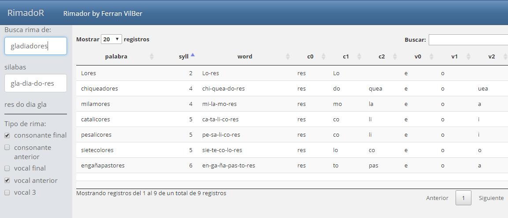

## Rimador
Esta semana los peques tenían que hacer una poesía para el cole, como veréis queridos lectores, los niños son una fuente inagotable de ideas incluso para programar con R.

Hace tiempo que abandoné mi parte artística así que, para compensar la oxidación mental se me ocurrió programar una sencilla aplicación que busque rimas y nos ayude a crear versos.

## Idea del programa

La idea parece sencilla, se trata 1) de escribir una palabra, 2) que una función descomponga en sílabas esta palabra, 3) que otra función busque palabras con la misma terminación.

El resultado que buscamos será una aplicación en la que pongas una palabra y busque otras con similar terminación o *rima*, que nos ayude a finalizar el verso.

Manos a la obra.

## Lemario
Lo primero que hice fue buscar un lemario, o tabla de palabras en español, algunos lenguajes como LaTeX tienen lemarios, pero encontré esta magnifica web en github: <a href="https://github.com/olea/lemarios" target="_blank" rel="noopener"><span>github.com/olea/lemarios </span> </a>.

En ella no solo proporcionan un lemario completo con mas de ochentamil palabras en español sino que además, tiene otro fichero con verbos conjugados que podríamos añadir al *lemario* para aumentar nuestra base de datos de palabras.

Descargamos estos ficheros a nuestro directorio de trabajo así:

```{r eval=FALSE}
# verbos conjugados en español
url <- "https://github.com/olea/lemarios/raw/master/verbos-espanol-conjugaciones.txt"
download.file(url,destfile = "./data/verbos-espanol-conjugaciones.txt")

# Lemario completo de términos en español
url <- "https://github.com/olea/lemarios/raw/master/lemario-general-del-espanol.txt"
download.file(url,destfile = "./data/lemario-general-del-espanol.txt")
```

## Silabear
El *lemario* es una lista de palabras y será la base de datos principal, ahora debemos programar una función que cada palabra del fichero línea a línea y nos calcule las sílabas. Esto no me ha resultado tan fácil como pensaba, y el resultado no es perfecto, pero bueno ya lo mejoraremos en el futuro.

He encontrado dos librerías que tienen funciones de silabeo (separar en sílabas), la primera opción con el paquete `hyphenatr`. 

```{r test_hyphenatr}
# Para instalar hyphenatr:
#  devtools::install_github("hrbrmstr/hyphenatr")
library(hyphenatr)
#seleccionamos el diccionario de Español
switch_dict("es_ANY")
# Usamos la función hyphenate para silabear
hyphenate("alucinante",simplify="-")
hyphenate("mordisco",simplify="-")

```
La función `hyphenate()` no es en realidad para silabear, sino para cortar palabras al final del párrafo, es decir para separar en guiones. Y como puedes ver en los resultados anteriores no lo hace muy bien, dejando muchas palabras sin dividir. Por tanto descartamos esta opción.

Buscando soluciones encontré el paquete <a href="https://github.com/unDocUMeantIt/koRpus" target="_blank" rel="noopener"><span>Korpus </span> </a> que tiene muchas funciones de análisis de textos. El resultado es mucho mejor, aunque no es perfecto. *Os ruego que si conocéis algún paquete o función mejor para separar en sílabas lo digáis en los comentarios*. 

El funcionamiento en `Korpus` es similar, hay que cargar la librería y después el idioma. La función de silabeo es `hyphen()`, que no busca exactamente silabear sino separar en guiones fin de línea como la anterior.

```{r, warning=FALSE, message=FALSE}
# Para instalar Korpus
## install.packages("koRpus")
library(koRpus)
# para instalar el lenguaje inglés y español:
##install.koRpus.lang(lang=c("en", "es"))
# Cargamos el idioma español
library(sylly.es)
# separa en silabas una palabra
# mostramos el objeto resultado de hyphen:
aux<-hyphen("montañoso", hyph.pattern="es",min.length=1)
   str(aux)
   # mostramos solo el data frame de silabas:
   aux@hyphen
```

La función `hyphen()` da el resultado en una clase de objeto especial, que contiene a su vez 3 propiedades (van precedidas de `@`), estos son `@lang`, `@desc` y `@hyphen`. El que nos interesa y que contiene las sílabas es el *data.frame* llamado `@hyphen`.

A los objetos de una clase en R se accede con el símbolo `@` de la misma forma que usamos `$` para una columna de una *data.frame*.

## Tabla de rimas

Como punto final vamos a calcular una tabla que contenga la base de datos de rimas que usaremos en la app. Para cada palabra del lemario calcularemos sus sílabas, le damos la vuelta para quedarnos solo con las 3 últimas y las almacenamos en la tabla.

Para añadir las opciones del *rimadoR*, además de la última sílaba consonante, también vamos a calcular la rima vocal, quitando las consonantes de las sílabas calculadas en el paso anterior. 

Un punto interesante en el código que vas a ver abajo es que he evitado el uso de bucles. La programación con R va mucho más fluída y rápida si lo hacemos sin bucles (for ... next), y para este caso con una tabla de 87.899 registros la función `map()` del paquete `purrr` es imprescindible <a href="https://enrdados.netlify.app/post/chuleta-de-purrr/" target="_blank" rel="noopener"><span>puedes ver este articulo del blog sobre purrr y listas en R </span> </a> .

El siguiente código crea una tabla con las palabras, calcula y separa por sílabas, da la vuelta al vector de sílabas y por último almacena en 3 columnas llamadas c0, c1 y c2 las últimas 3 sílabas consonantes de la palabra, y como v0, v1 y v2 las 3 últimas silabas vocales de la misma palabra. Luego almacenamos la tabla en un fichero llamado *bdsilabas.csv* que después usaremos en la aplicación *shiny*.

```{r db_de_silabas, eval=FALSE}
# Cargamos la librería Korpus
library(koRpus)
library(sylly.es) # cargamos el idioma esp
library(tidyverse) # para usar purrr map

# Leemos el fichero de lemario que descargamos antes
# y almacenamos las palabras en un data frame.
file<-"./data/lemario-general-del-espanol.txt"
lemario<-readLines(file, encoding="UTF-8")
dt<-data.frame(palabra=lemario)
# nrow(dt)

# calculamos las sílabas de cada palabra
silabas<-(hyphen(dt$palabra, hyph.pattern="es",min.length=1))
   # guardo solo la la data frame con las sílabas y el num de silabas   
   bd<-cbind(dt,silabas@hyphen)
   rm(silabas) # borro la variable de clase para limpiar
# separo las silabas encontradas en un vector
list_aux<- strsplit(bd$word,"-") 
# le damos la vuelta al vector para dejar primero
# las últimas silabas. strsplit da como resultado una lista
# por lo que usamos map() para aplicar a cada elemento 
# de la lista la función rev() 
list_aux <- map(list_aux, ~.x %>% rev())

# Almacenamos las 3 columnas de rima consonante
bd$c0<- map_chr(list_aux, ~.x[1])
bd$c1<- map_chr(list_aux, ~.x[2])
bd$c2<- map_chr(list_aux, ~.x[3])

# Quitamos la consonantes para tener la rima vocal
 bd$v0<- gsub("[^aeiouáéíóú]","",bd$c0)
 bd$v1<- gsub("[^aeiouáéíóú]","",bd$c1)
 bd$v2<- gsub("[^aeiouáéíóú]","",bd$c2)

# veamos unas palabras de ejemplo 
bd[sample(1:80000,10),]

#Guardamos la tabla calculada como bdsilabas.csv 
write.table(bd,"bdsilabas.csv",
            quote = FALSE, # Sin dobles comillas en cadenas
            sep = ";", # Separador de campos
            row.names = FALSE # No coge nombres de filas del DF
            )
```

## Crear aplicación shiny

Con el material base hecho ahora nos toca hacer la app dinámica para poder hacer las consultas.

Usaré como siempre *flexdashboard*. <a href="https://enrdados.netlify.app/post/shiny-facil-con-flexdashboard-iv/" target="_blank" rel="noopener"><span> Consulta aquí la serie de articulos dedicados a felx en este blog </span> </a> 

La app será sencilla, con una barra lateral en la que podremos meter la palabra inicial y las opciones de rima, y la parte central será el resultado como consulta directa de la tabla. Puedes ver esta imagen del aspecto final:



Como cosas interesantes he usado un `observeEvent()`. Lo que hace es vigilar los cambios de un `inputText` y si se producen hace que se actualice -en tiempo real- otro `inputText` diferente con las silabas. Es decir según escribimos la palabra, va calculando las sílabas y las escribe en otro `inputText` usando dentro del `observeEvent` la función `updateTextInput()`.

Para filtrar la tabla con las opciones de rima usamos un `checkboxGroupInput` con varias opciones. Y para mostrar los resultados una DT con todo su dinamismo. Puedes ver un truco para que los botones del DT se vean en español.

Nuestra app se ejecuta en local con este código:

````markdown
---
title: "RimadoR"
output:
  flexdashboard::flex_dashboard:
    theme: spacelab    
    orientation: columns
    vertical_layout: fill
editor_options: 
  chunk_output_type: console
runtime: shiny
---

```r '{r setup, include=FALSE}
library(flexdashboard)
library(DT)
#library(rvest)
#library(dplyr)
library(stringr) # funciones de palabras
library(koRpus)
library(sylly.es)
```

<style> .datatables{ overflow: auto; font-size: 9pt} </style> 

# Rimador by Ferran VilBer

```r '{r}
# lee la tabla de lemario con silabas
bd<-read.csv("bdsilabas.csv",header = T, sep = ";" )
```

## Entradas {.sidebar data-width=150}

```r '{r}
# Barra lateral de controles
## palabra input
textInput("palabra", "Busca rima de:", value = "gladiador") # limitamos el tamaño 
#  calcula las silabas de la palabra anterior
textInput("silabas", "silabas", value = "silaba")
# 
pal <- reactive({
  sila<-hyphen(str_to_lower(input$palabra), hyph.pattern="es",min.length=1)[1,2]
  rev(unlist(strsplit(sila,"-")[1]))
  })
# escribe la palabra separada de silabas al revés
renderText(pal())
# insertamos una linea de separacion
tags$hr(style="border-color: black;")

#cambia en tiempo real el silabeo
observeEvent(input$palabra, {
   y <- input$palabra
   if (is.null(y)) y <- "gladiador"
   #chs <- if(y=="invalido") 0:54 else 0:74
   sila<-hyphen(y, hyph.pattern="es",min.length=1)[1,2]
   updateTextInput(session, "silabas", value = sila)
})
# opciones de rima
checkboxGroupInput("rimas", "Tipo de rima:",
                  choices = list("consonante final", "consonante anterior", "vocal final", "vocal anterior", "vocal 3"),
                  selected=list("consonante final", "vocal anterior"))

```

## Tabla de datos

```r '{r tablaa}
# pinta la tabla con los filtros aplicados
DT::renderDataTable({
    filtro<-bd
    if("consonante final" %in% input$rimas)
      filtro <- filtro[filtro$c0==pal()[1],]
    if("consonante anterior" %in% input$rimas)
      filtro <- filtro[filtro$c1==pal()[2],]
    if("vocal final" %in% input$rimas){
      v0<- gsub("[^aeiouáéíóú]","",pal()[1])
      filtro <- filtro[filtro$v0==v0,]
    }
    if("vocal anterior" %in% input$rimas){
      v1<- gsub("[^aeiouáéíóú]","",pal()[2])
      filtro <- filtro[filtro$v1==v1,]}
    if("vocal 3" %in% input$rimas){
      v2<- gsub("[^aeiouáéíóú]","",pal()[3])
      filtro <- filtro[filtro$v2==v2,]}

 DT::datatable(filtro, rownames = FALSE ,options = list(
    bPaginate = TRUE,
    pageLength = 20,
    # para pasarlo a Español visto en: https://rstudio.github.io/DT/004-i18n.html
    language = list(url = '//cdn.datatables.net/plug-ins/1.10.11/i18n/Spanish.json'),
    order = list(list(1, 'asc'))
  ))
})
```
````
