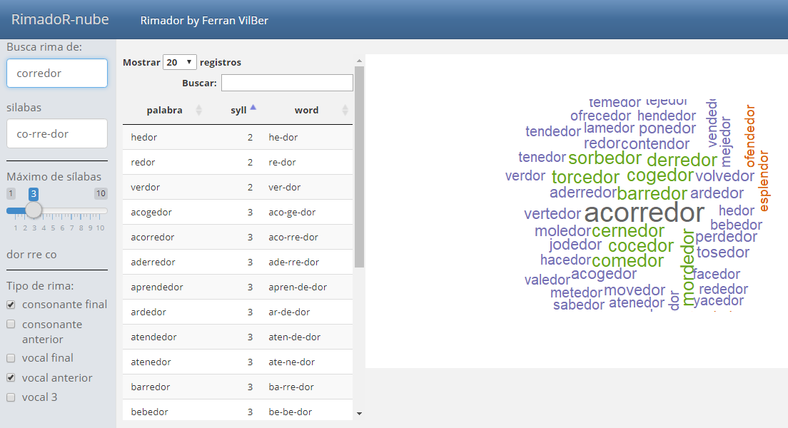

El rimador que hicimos semana pasada quedó un poco soso. Así que, vamos a programar unas algunas mejoras para hacer la aplicación más divertida, al fin y al cabo era para jugar y que la usaran los peques de la casa.

Pensé en poner los resultados en una nube de palabras en lugar de la tabla. También he añadido un selector para concretar los resultados por sílabas, así es más fácil buscar rimas. 

## Selector de sílabas 
Para hacer una selección por el número de sílabas he puesto en el sidebar de la aplicación un objeto *input* nuevo. En este caso una barra de selección móvil o *slider* simplemente añadimos en el sidebar esto:

```{r, eval=F}
#sliderInput(nom_input, label,min, max, valor_defecto)
sliderInput("nsil", "Máximo de sílabas", min=1, max=10,value=10)
```

El valor de este *splider* lo podemos usar en cualquier cálculo en tiempo real mediante la variable `input$nsil`, como veremos mas adelante.

## Filtro de la base de datos de palabras
Para que el filtro que hacemos sobre la base de datos recoja esta nueva selección del *slider*, lo sacamos de `renderDataTable` y lo ponemos como variable reactiva, por ejemplo así:

```{r, eval=F}
filtro<-reactive({
      filtro<-bd
    # añadimos filtro por sílabas  
      filtro<-filtro[filtro$syll<=input$nsil,]
    # resto de filtros igual que antes  
    if("consonante final" %in% input$rimas)
      filtro <- filtro[filtro$c0==pal()[1],]
    if("consonante anterior" %in% input$rimas)
      filtro <- filtro[filtro$c1==pal()[2],]
    if("vocal final" %in% input$rimas){
      v0<- gsub("[^aeiouáéíóú]","",pal()[1])
      filtro <- filtro[filtro$v0==v0,]
    }
    if("vocal anterior" %in% input$rimas){
      v1<- gsub("[^aeiouáéíóú]","",pal()[2])
      filtro <- filtro[filtro$v1==v1,]}
    if("vocal 3" %in% input$rimas){
      v2<- gsub("[^aeiouáéíóú]","",pal()[3])
      filtro <- filtro[filtro$v2==v2,]}
    return(filtro)
    })

# pintamos la tabla
DT::renderDataTable({
 DT::datatable(filtro()[,c(1:3)], rownames = FALSE ,options = list(
    bPaginate = TRUE,
    pageLength = 20,
    # para pasarlo a Español visto en: https://rstudio.github.io/DT/004-i18n.html
    language = list(url = '//cdn.datatables.net/plug-ins/1.10.11/i18n/Spanish.json'),
    order = list(list(1, 'asc'))
  ))
})
```

También he acortado las columnas que salen en pantalla y solo nos quedamos ocn las 3 primeras (palabra, numero de sílabas y palabra separada por sílabas) `filtro()[,c(1:3)]`. 
La salida de tabla la dejamos en la misma columna, pero acortamos su ancho para que quepa la nube de palabras. Esto lo hacemos añadiendo el data-with en la definición de columna: `## Tabla de datos {data-width=250}`. Tambén añadimos una columna nueva que llamaremos nube. Esto se hace simplemente añadiendo linea con doble almohadilla: `## nube `

## Nube de palabras
Para hacer nubes de palabras necesitamos la librería `wordcloud`. El uso es bastante intuitivo, se pasa un vector de palabras y otro con las frecuencias, después algunas propiedades como la escala que indica el tamaño de letra máximo y mínimo o el color.

Para las frecuencias, he pensado en utilizar alguna función de distancia entre palabras. En Rbase está `adist()` que es la que he usado aquí. 

La distancia la calcula por el número de letras que hay que cambiar para llegar a la palabra origen. Esto quiere decir que, a menor distancia más parecidas son las palabras. Esta métrica es bastante bruta, y hay otras librerías con funciones mejores y más complejas como:

 - `adist()` en Rbase
 - `stringMath()` en MiscPsycho
 - `stringdist()` en stringdist
 - `levenshteinDist()` en RecordLinkage
 
Para este caso he usado el inverso de `adist()` multiplicado por un coeficiente como 1000. Es una forma simple para no marearnos mucho.

La nube la ponemos en una columna nueva, esto se hace añadiendo `## nube` en el fichero Rmarkdown y a continuación este código para crearla.

La librería `wordcloud` genera una imagen, por lo que para mostrarla en la aplicación usaremos `rederPlot()`. 

```{r, eval=F}
library(wordcloud)

renderPlot({
    w <- filtro()
    w<-sort(w$palabra)
    f<-as.vector(adist(input$palabra, w))
    f<-as.integer((1000/f))

    # dibuja la nube de palabras    
    wordcloud(w, f, scale=c(3,1),
                  random.order=F,
                  min.freq = 1, max.words=50,
                  colors=brewer.pal(8, "Dark2"))
  })
```
El resultado es nuestra nueva app de rimas:




## Otras nubes más complejas
Ya que estamos con nubes solo comentar que además del paquete `wordcloud` está la versión 2 llamada `wordcloud2` que permite muchas más opciones para las nubes de palabras. Una ventaja de `wordcloud2` es que tiene un objeto específico para shiny (`renderWordcloud2`).

Veamos un ejemplo simple con el texto inicial del Quijote:

```{r, nubespalabras}

# librería de text mining para tokenizar textos
library(tokenizers)
# para instalar el paquete
#install.packages("wordcloud2")
library(wordcloud2)

texto<-c("En un lugar de la Mancha, de cuyo nombre no quiero acordarme,
         no ha mucho tiempo que vivía un hidalgo de los de lanza en astillero,
         adarga antigua, rocín flaco y galgo corredor. Una olla de algo más vaca
         que carnero, salpicón las más noches, duelos y quebrantos los sábados,
         lantejas los viernes, algún palomino de añadidura los domingos,
         consumían las tres partes de su hacienda. El resto della concluían
         sayo de velarte, calzas de velludo para las fiestas,
         con sus pantuflos de lo mesmo,
         y los días de entresemana se honraba con su vellorí de lo más fino.
         Tenía en su casa una ama que pasaba de los cuarenta y una sobrina
         que no llegaba a los veinte, y un mozo de campo y plaza que así 
         ensillaba el rocín como tomaba la podadera. Frisaba la edad de
         nuestro hidalgo con los cincuenta años. Era de complexión recia,
         seco de carnes, enjuto de rostro, gran madrugador y amigo de la caza.
         Quieren decir que tenía el sobrenombre de «Quijada»,
         o «Quesada», que en esto hay alguna diferencia en los autores
         que deste caso escriben, aunque por conjeturas verisímiles se
         deja entender que se llamaba «Quijana». Pero esto importa poco
         a nuestro cuento: basta que en la narración dél no se salga
         un punto de la verdad")

palabras <- tokenize_words(texto)
tab <- table(palabras[[1]])
tab <- data.frame(word = names(tab), freq = as.numeric(tab))
head(tab)
#pintamos la nube de palabras con wordcloud2
wordcloud2(tab, color = "random-light", backgroundColor = "white")
```

