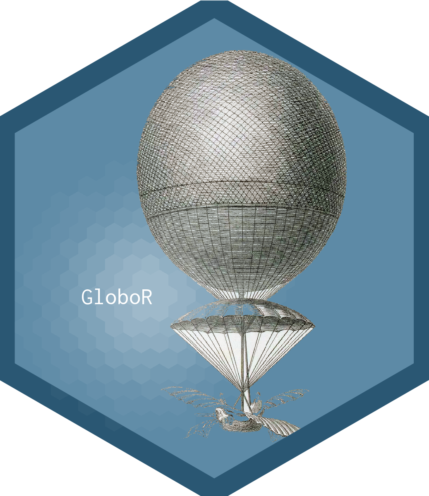

Cuando hice el logo del blog no sabía que existía un paquete dedicado a esto de hacer logos hexagonales en R, así que lo diseñé con un programa gráfico al estilo "tradicional".

El ecosistema de R está creciendo tan rápido que hoy día podemos encontrar librerías para TODO, incluso para pintar nuestro logo hexagonal sin salir del entorno del programa. Preparad vuestra imaginación que hoy vamos a hablar de la librería [hexSticker](https://github.com/GuangchuangYu/hexSticker) con la que vamos a diseñar unos cuantos logos.


## hexSticker 
Se trata de un paquete que puedes instalar desde CRAN, y cuya web de desarrollo está en github <https://github.com/GuangchuangYu/hexSticker>. Para instalar el paquete:
 
```{r, eval=FALSE}
# Instalar el paquete
install.packages("hexSticker")
```
 
Su uso principal es para hacer logos de nuevos paquetes, pero también lo puedes usar para lo que quieras relacionado con pintar hexágonos, que es lo que hace. 

Básicamente crea un hexágono en el que puedes elegir los colores de fondo, el borde y algunos parámetros gráficos, además puedes insertar dentro unos complementos que son:
 
  * una imagen externa (jpg, png, svg...), o un gráfico de ggplot que sitúa en el centro del hexágono
  * un título o nombre del paquete que por defecto sitúa como texto en el centro
  * un enlace web, por defecto situado en la parte baja derecha de la figura.

Para cada una de estas cosas nos deja unas opciones de personalización como desplazarlas un poco en x o y por el lienzo, modificar el tipo y tamaño de letra y los colores. Además tiene otros argumentos para limpiar la zona exterior del hexágono si se sale la imagen (`white_around_sticker`) o añadir un reflejo luminoso al logo (`spotlight`) que da un toque especial más profesional.

Lo mejor es ver cómo funciona sobre ejemplos. En este primer caso tenemos una pequeña imagen (png) de un globo con fondo transparente que queremos poner en el centro del sticker:

```{r}
library(hexSticker)
#ruta relativa a la imagen de fondo que queremos en el logo
imgurl <- "images/globo2.png"

# creamos nuestro sicker
logo.1<-sticker(imgurl, #imagen de fondo
             s_x=1, s_y=1, # posición imagen relativa 1=centro
             s_width=0.6, s_height=0.5, #estirar la imagen ancho-largo 
             #opciones del título
             package="GloboR", # titulo del logo
             p_color = "black", #color de la fuente de titulo
             p_size=15, # tamaño fuente del titulo
             p_x = 0.7, p_y = 1.4, #posicion del titulo
             #opciones de la url
             url = "www.enrdados.net", # url
             u_color = "white", # color fuente enlace
             u_size = 6, # tamaño del fuente enlace
             h_fill="salmon", h_color="black",h_size = 2, #color de relleno, borde hex y grosor de linea
             #opciones generales
             filename="globo1.png", # fichero de salida
             white_around_sticker = T,# recorta el borde exterior del hex
             spotlight=F) #añade una luz que ilumina parte del sticker
             #dpi = 600)

logo.1
```


## GloboRR 

Esta vez partimos de un png transparente que metemos en un hexagono de color azul y añadimos un brillo en el sticker

```{r}
library(hexSticker) # Create Hexagon Sticker in R 
library(showtext)   # Using Fonts More Easily in R Graphs  
#Loading Google fonts (http://www.google.com/fonts)
font_add_google("Inconsolata", "incon")  

logo.2<-sticker(
   # Subplot (image)
   subplot = "images/globo2.png",       # nombre y ruta relativa de la imagen
   s_y = 1,                          # Posición  (y)
   s_x = 1.1,                       # Posición  (x)     
   s_width = 0.6,                   # ancho , escala 1=sin cammbios   
   s_height=0.6,                    # alto   
   # Font
   package = "GloboR",            # titulo 
   p_size = 15,                       # Fuente tamaño
   p_y = 0.8,                        # Posición tit (y)
   p_x=0.6,                         # Posición tit (x)
   p_family = "incon",               # Define fuente letra
   # Spotlight
   spotlight = TRUE,                 # pone el brillo o luz
   l_y=0.8,                          # Posición de la luz (y)
   l_x=0.7,                          # Posición de luz (x)
   # Sticker colors
   h_fill = "#5d8aa6",               # Color del fondo 
   h_color = "#2A5773",             # Color del borde
   h_size=3,                        # ancho del borde
   # Resolution
   dpi=600,                         # Sets DPI
   # Save
   filename="logo3.png"               # define el fichero destino
                                     # donde almacena el sticker 
   )

logo.2
```


### Stiker de enRdados

Aunque tengo el logo del blog hecho, he visto que el hexágono no me salió perfecto, vamos que está como estirado. Para arreglarlo voy a usar `hexSticker` tomando el logo actual como fondo de uno nuevo generado con la librería.

```{r, logoenredados}
#ruta relativa a la imagen de fondo del icono
imgurl <- "images/LogoenRdados.png"
logoenRdados<-sticker(imgurl, #imagen de fondo
             s_x=1.01, s_y=0.95, # posicion imagen
             s_width=1.1, s_height=1, #estirar la imagen ancho-largo 
             package="", # nombre del paquete
             p_color = "black", #color de la fuente de paquete
             p_size=10, # tamaño fuente del paquete
             p_x = 1, p_y = 1,
             url = "www.enrdados.net", # url
             u_color = "white", # color fuente enlace
             u_size = 5, # tamaño del fuente enlace
             h_fill="#f9690e", h_color="firebrick4",h_size=3, #relleno y borde hex
             filename="logo2.png", # fichero de salida
             white_around_sticker = T,# recorta el borde exterior del hex
             spotlight=F, #añade una luz que ilumina parte del sticker
             dpi = 600) # higher dpi means higher resolution)

#añade una linea de hexagono nueva
#p.3 <- p.2 +  geom_hexagon(size = 1, fill = NA, color = "black")
logoenRdados
```


### Sticker con ggplot

Por ultimo vamos a hacer un logo nuevo usando una gráfica de ggplot, en este caso un mapa de España para el que usaré la librería `mapSpain` de [rOpenSpain](https://ropenspain.es/), por cierto no dejes de ver esta web, están haciendo un trabajo tremendo para acceso a datos libres en España.

```{r}
library(hexSticker)
library(ggplot2)
library(mapSpain) # de rOpenSpain
library(sf) # para capas

# cargamos una capa de españa con las comunidades autónomas
CCAA.sf <- esp_get_ccaa() # función de mapSpain

mapaESP<-ggplot(CCAA.sf) +
    geom_sf(color = "black", fill = "lightgrey")+
    theme_void() # quita ejes y escalas del mapa

# vemos el mapa generado:
mapaESP

# ahora creamos el sticker con este mapa imagen de ggplot
logo.mapaES <- sticker(mapaESP,
                  s_x=1, s_y=0.9, s_width=1.5, s_height=2,                     
                  package="EspañaRR ",
                  p_color = "black", #color de la fuente de paquete
                  p_size=10, # tamaño fuente del paquete
                  p_x = 1, p_y = 1.5,  
             url = "www.enrdados.net", # url
             u_color = "white", # color fuente enlace
             u_size = 4, # tamaño del fuente enlace
             #hexagono:
             h_fill="#478bca", h_color="black",h_size = 2, # relleno y borde hex
             filename="mapa-sticker.png", # fichero de salida
             white_around_sticker = T,# recorta el borde exterior del hex
             spotlight=T,l_x=0.5,l_y=1.4)


logo.mapaES

```


Esto es todo, espero que con los ejemplos quede claro cómo usar HexSticker.

Adelante con R!


