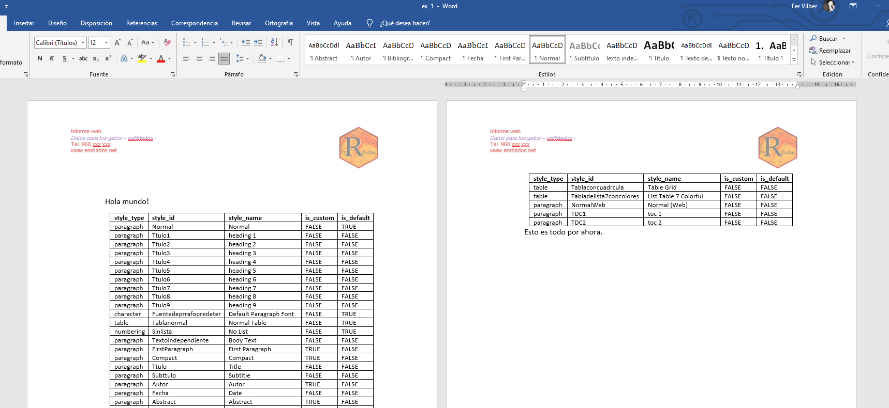
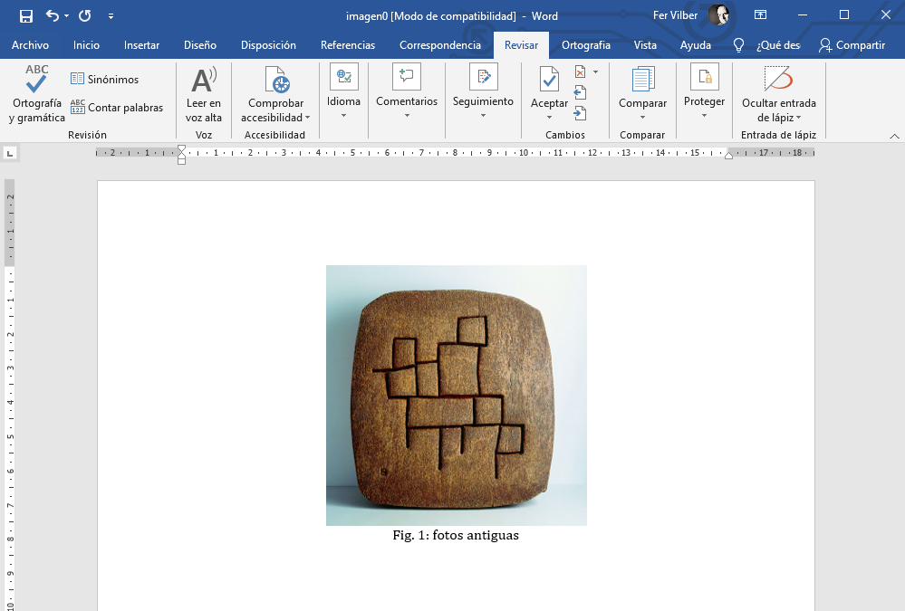
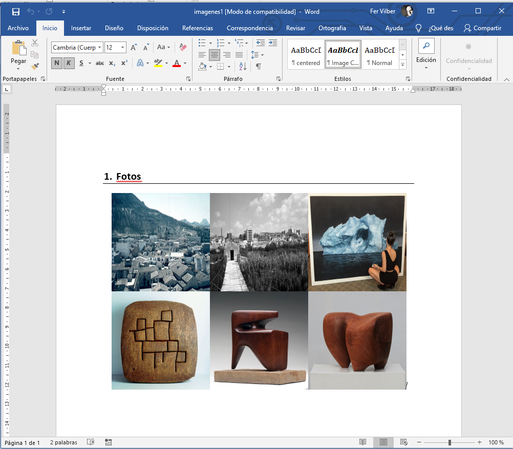
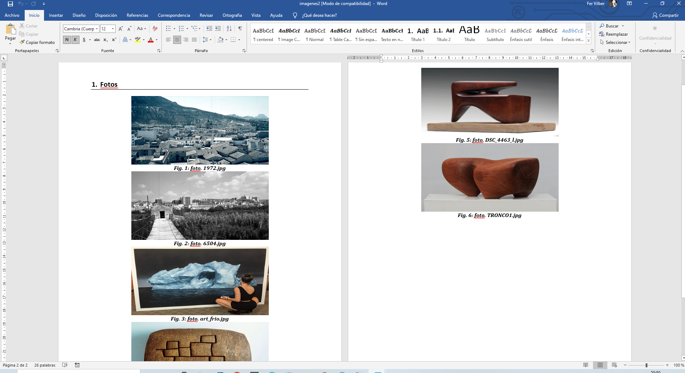
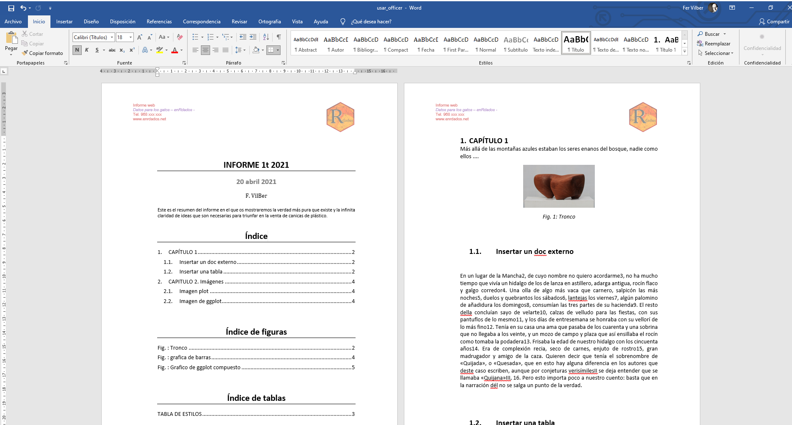
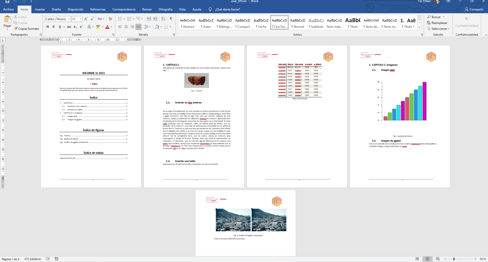

Hoy no voy a convencer a nadie de las ventajas y maravillas de usar R en el trabajo diario, incluso para la generación de documentos, informes y cartas... no, hoy no, la batalla está perdida desde hace tiempo, pero al menos vamos a alumbrar una opción para domar a  la bestia directamente desde sus entrañas, pues desde R vamos a poder generar documentos del paquete para oficinas más extendido. 

**Microsoft Office** es una suite ofimática que todos conocemos. Hoy vamos a mostar cómo trabajar documentos Word, el procesador de texto de Office, desde R usando el paquete [officer](https://davidgohel.github.io/officer/). Esta librería nos permite usar la aplicación WORD (también EXCEL Y Power Point) desde entorno R, y aplicar automatización y programación directamente en estos formatos con lo que nos abre un mundo de posibilidades.

## Antecedentes
Crear documentos Word desde RSTUDIO es fácil con `Knit` pues cualquier documento *markdown* puede imprimirse en varios formatos por ejemplo html, pdf o word. Esto lo vimos <a href="https://enrdados.netlify.app/post/informes-html-con-rmarkdown/" target="_blank" rel="noopener"><span> aquí </span> </a>.

Lo que aporta `officer` es un control completo de *Office* desde el entorno de R y especialmente el poder programar sin necesidad de hacerlo en Visual Basic, todo con lenguaje R. 

## Primeros pasos con officer
`officer` en un paquete de R muy completo, vamos a ir introduciendo algunos comandos y ejemplos. Personalmente lo primero que hice para usar esta librerñia es guardar una plantilla Word con los estilos, encabezados y pié de página que necesito. Este documento es el que llamaré más tarde para completarlo y usar los estilos que ya tengo definidos.

Para este ejemplo el *doc* de plantilla se llama `plantilla_enrdados.docx` y contiene unos estilos personalizados.
Puedes encontrar un manual completo de este paquete [aquí](https://ardata-fr.github.io/officeverse/index.html#the-officeverse).

Vamos con los primeros ejemplos, primero vamos a ver los estilos que tenemos disponibles en la plantilla que hemos creado:

```{r, eval=FALSE}
  library(officer)
# lee el fichero plantilla
  doc <-read_docx(path = "plantilla/plantilla_enredados.docx")
# guarda los estilos en una tabla
  estilos<-styles_info(doc)
  head(estilos)
```

##  Crear nuevo doc
Para crear un documento basta con llamar a la función `doc <- read_docx()`. Si queremos que tome de ejemplo la plantilla debemos poner la ruta al documento word base. También deberías cargar la librería `(magrittr)` que nos permite usar el comando *pipe* `%>%` en código y enlazar llamadas de función con el formato *"tubería"*.

Veamos un ejemplo en el que leemos la plantilla base e insertamos un párrafo y una tabla. Usaremos las funciones `body_add_par()` y `body_add_table()` indicando el estilo con el que se insertan. Finalmente imprimimos el documento, que nos queda como un nuevo fichero en el directorio de trabajo.


```{r, eval=FALSE}
library(officer)
library(magrittr)
doc <- read_docx(path = "plantilla/plantilla_enredados.docx") %>%
  body_add_par("Hola mundo!", style = "Normal") %>%
  body_add_table(estilos, style = "Table Grid")%>%
  body_add_par("Esto es todo por ahora.", style = "Normal")
# guardamo el nuevo doc con un nombre
print(doc, target = "ex_1.docx")
```

Si vamos a la carpeta de trabajo tendremos un nuevo documento: "ex_1.docx", con el siguiente contenido.



## Insertar tablas
Como hemos visto, insertamos cualquier tabla de datos (en data frame) con la función `body_add_table()`.

## Insertar imagenes
Para insertar imágenes tenemos varias opciones, la más simple es la función `body_add_img()` en la que pasamos como argumentos el documento donde se inserta, y la ruta de la imagen. Si además queremos añadir un título y una numeración automática a la imagen usaremos las funciones `block_caption()` y `run_autonum()`.

Veamos un ejemplo:

```{r insertar_imagen, eval=FALSE}
require(officer)
require(magrittr)
doc <- read_docx()
# añadir una imagen al documento doc
  doc <- body_add_img(doc, src = "imag/chillida-tierra.jpg",
                      height = 3, width = 3,
                      style = "centered")
# calculamos el autonumero
  run_num <- run_autonum(seq_id = "Fig", pre_label = "Fig. ", post_label = ": ")
# creamos el bloque del título de imagen 
  caption <- block_caption("fotos antiguas", style = "centered", autonum = run_num )
# insertamos el titulo en el documento y después un salto de línea
  doc <- body_add_caption(doc, caption) %>% body_add_break()
#Guardamos el fichero creado con código
  print(doc, target = "imagen0.docx")
```





Puede parecer que con esto trabajamos mucho más que abriendo el Word e insertando la imagen, pero la ventaja invisible es que podemos automatizar estas tareas. Más adelante veremos cómo crear un *script* que lea las imágenes en un directorio completo y las inserte directamente en el documento Word con su título y numeración.

Otra opción para insertar imágenes - en este caso las generadas con código R- es la función `body_add_plot` que inserta la salida de la función `plot`, o la función `body_add_gg()` que hace lo mismo para gráficos de hechos con `ggplot2`.

```{r ejemplo_imag2, eval=FALSE}
doc <- read_docx()

if( capabilities(what = "png") )
  doc <- body_add_plot(doc,
    value = plot_instr(
      code = {barplot(1:5, col = 2:6)}),
      style = "centered" )

print(doc, target = tempfile(fileext = ".docx") )
```

Dentro del argumento `value`, podemos meter tanto el código como en el ejemplo anterior o la variable con el gráfico, como haremos en el ejemplo completo.

### Insertar muchas imagenes
Los que hemos usado *Microsoft Office* sabemos lo incómodo y problemático que es hacer estas cosas desde la suite, por lo que hacerlo con código R es una liberación y además bastante fácil.

Tenemos una carpeta llamada *"imag"* en nuestro directorio de trabajo, en la que hay muchas fotos y queremos ponerlas todas en un doc de Word, veamos como lo hacemos:

```{r, eval=FALSE}
# Inserta todas las imágenes de una carpeta en un doc
require(officer)
require(magrittr)
doc <- read_docx() # creamos un doc
# Añadimos un titulo de capitulo y un parrafo vacio
doc <- body_add_par(doc,value = "Fotos", style = "heading 1") %>%
       body_add_par("  ", style = "Normal")

# Guardamos en la variable imagenes una lista de todas las del directorio que sean jpg
imagenes<-list.files("imag/", pattern = "*.jpg", full.names = TRUE ) 
# Insertamos las imagenes en el documento  
doc <- body_add_img(doc, src = imagenes, height = 2, width = 2, style = "Image Caption")
# Guardamos el documento en el dir de trabajo con este nombre
print(doc, target = "imagenes1.docx")
```

El resultado es este, ha sido muy fácil y en un momento:



Como vemos se han insertado todas las imágenes juntas, sin títulos. Para insertar cada imagen por separado y con numeración y título hay que decirselo, por ejemplo con este código:

```{r, eval=FALSE}
require(officer)
require(magrittr)
# Crea un docx
  doc <- read_docx()
# Inserta un título y párrafo vacío
  doc <- body_add_par(doc,value = "Fotos", style = "heading 1") %>%
       body_add_par("  ", style = "Normal")
# lee los nombres de las imágenes
# y la ruta completa y lo almacena en 2 var
  ruta<-"imag/"
  imagenes_n<-list.files(ruta, pattern = "*.[jp][pn]g", full.names = FALSE )
  imagenes<-list.files(ruta, pattern = "*.[jp][pn]g", full.names = TRUE )
  
# Inserta cada imag en el doc con un bucle for
for(i in seq_along(imagenes)){
  doc <- body_add_img(doc, src = imagenes[[i]],
                      height = 2.5, width = 4,
                      style = "Image Caption")
  # numera la imágen
  run_num <- run_autonum(seq_id = "fig", pre_label = "Fig. ", post_label = ": ")
  # Les pone un titulo
  caption <- block_caption(paste("foto.",imagenes_n[[i]]), style = "graphic title", autonum = run_num )
  # Mete el titulo numerado
  doc <- body_add_caption(doc, caption) 
}
# guarda el doc
  print(doc, target = "imagenes2.docx")
```

Hay que tener cuidado y usar los estilos que tenga disponibles el documento word, aunque  de todas formas si pones uno que no exista te avisa en el panel y dice cuales puedes usar.

El resultado ahora es este, te puedes imaginar que cuando se trata de muchas imagenes puede ahorrarte mucho tiempo.



## Marcadores

Hasta ahora hemos añadido párrafos o imágenes de forma secuencial en el documento, en orden, pero con *officer* podemos elegir en qué parte del documento insertamos cada elemento posicionando el puntero interno con alguna de las funciones marcador: `cursor_begin(doc)`, `cursor_bookmark(doc, id)`, `cursor_end(doc)`, `cursor_reach(doc, keyword)`, `cursor_forward(doc)`, `cursor_backward(doc)`.

Estas funciones complementan a esta que crean marcadores: `body_bookmark(doc, "nombre_marcador")`.

## Indice del documento
Para insertar un índice (TOC = tabla de contenido) en el documento usaremos la función `body_add_toc(level=2)`, indicando hasta qué nivel de título queremos que salga. 

```{r, eval=FALSE}
# Creamos un marcador donde queremos el indice
doc<- body_bookmark(doc,"pos_indice")
#insertamos TOC
doc<- cursor_bookmark(doc, "pos_indice") %>%
        body_add_par("Índice", style = "Title") %>%
        body_add_toc(level = 1) #solo titulos nivel 1  
```

En el ejemplo completo tienes también la forma de insertar un índice de imagenes, figuras o tablas, como verás solo depende del estilo que selecciones.

## Insertar documento externo

Otra función interesante de es `body_add_docx(doc, ruta_documento_a_insertar, marcador_de_posicion)` que inserta el texto de un documento word en otro, lo que nos sirve para unir documentos.

## Ejemplo completo

Como resumen vamos a generar un documento completo y complejo de word con R, fijaos bien en que el documento se hace añadiendo párrafos con `body_add_par()` y asignando a estos párrafos un estilo. Según el estilo asignado puede ser un título 1, 2, o un texto normal.

Partimos de una plantilla que contiene estilos propios con los que habitualmente trabajo, y con un encabezado y pie de la página ya personalizado. Este documento vacío es lo que sirve de plantilla.

En algunos puntos ponemos un marcador, para luego poder volver e insertar cosas posteriormente en ese preciso lugar.

```{r completxt, eval=FALSE}
# Cargamos las librería
library(officer)
library(magrittr) # para usar operador %>% pipe

# Leemos la plantilla
  doc_3 <-read_docx(path = "plantilla/plantilla_enredados.docx")
# Empezamos con el titulo, subtitulo  y autor7
  doc_3 <-body_add_par(doc_3,"INFORME 1t 2021", style = "Title") %>%
        body_add_par("20 abril 2021", style = "Subtitle") %>%
        body_add_par("F. VilBer", style = "Autor") 

#Añadimos un párrafo normal
  doc_3 <-body_add_par(doc_3 ,"Este es el resumen del informe en el que os mostraremos la verdad más pura que existe y la infinita claridad de ideas que son necesarias para triunfar en la venta de canicas de plástico.", style = "Abstract") %>%
    body_bookmark("pos_indice") %>% # marca una posición
    body_add_par("CAPÍTULO 1", style = "heading 1") %>%
    body_add_par("Más allá de las montañas azules estaban los seres enanos del bosque, nadie como ellos ....", style = "Normal")

# Añadimos una imagen 
  ruta_img<-"imag/TRONCO1.jpg"
  doc_3 <-body_add_img(doc_3,src = ruta_img,
                       height = 1.2, width = 2,
                       style = "Figure") %>% 
          body_add_caption(block_caption("Tronco", style = "Image Caption", 
                    autonum = run_autonum(seq_id = "fig", pre_label = "Fig. ",
                                      post_label = ": ", bkm = "marca_tronco") ))

#Añadimos otro documento y lo insertamos como párrafo    
  doc_3 <-body_add_docx(doc_3,src = "plantilla/pliego.docx") 

# añadimos una tabla
  estilos<-styles_info(doc_3) # esta es la tabla que usaremos

  doc_3<-body_add_par(doc_3,"Insertar una tabla", style = "heading 2") %>% # titulo 1
    body_add_par("Exponemos los 20 primeros estilos contenidos en este documento. ") %>%
    body_add_table(head(estilos, n = 10), style = "Table",first_column = TRUE) %>%
    body_add_caption(block_caption("TABLA DE ESTILOS", style = "Table Caption"))%>%
    body_add_par(" ") %>% 
# Añadimos algún capítlo de ejemplo
    body_add_par(value = "CAPITULO 2. Imágenes", style = "heading 1") %>% 
    body_add_par(value = "Imagen plot", style = "heading 2") 
# metemos una imagen autonumerada de plor
  if( capabilities(what = "png") )
  doc_3 <- body_add_plot(doc_3,
        value = plot_instr(
          code = {barplot(1:10, col = 2:6, axes=T)}),
          style = "Figure",height = 5, width = 5)
    #run_rum es para autonumericos como figuras etc..
    run_num <- run_autonum(seq_id = "fig", pre_label = "Fig. ", post_label = ": ")
    caption <- block_caption("grafica de barras", style = "Image Caption", autonum = run_num )
    # Añadimos el titulo de la imagen y un salto de linea
  doc_3 <- body_add_caption(doc_3, caption) #%>% body_add_break()

  doc_3 <-body_add_par(doc_3,value = "Imagen de ggplot", style = "heading 2") %>%
    body_add_par("Este es un ejemplo más complejo en el que usamos patchwork para juntar gráficos mediante código y luego imprimirlos en word.", style = "Normal")

# test de insertar imagenes ggplot
        library(ggplot2)
        library(patchwork)
        library(cowplot)
        p4<-ggdraw() +
          draw_image("imag/1972.jpg") 
        # juntamos gráficos 
        p3<-p4 +p4

  doc_3 <- body_add_gg(doc_3, p3, style = "Figure",height = 2, width = 6)
  run_num <- run_autonum(seq_id = "fig", pre_label = "Fig. ", post_label = ": ")
  caption <- block_caption("Grafico de ggplot compuesto",
                           style = "Image Caption",
                           autonum = run_num )
  # Añadimos el titulo de la imagen y un salto de linea
  doc_3 <- body_add_caption(doc_3, caption)

# Insertamos el indice del documento en el principio, en el marcador pos_indi que ya creamos antes
  doc_3<- cursor_bookmark(doc_3, "pos_indice") %>%
        body_add_par("Índice", style = "Title") %>%
        body_add_toc(level = 2) %>% # añade indice de nivel 2 %>% 
        body_add_par("Índice de figuras", style = "Title") %>% 
        body_add_toc(style = "Image Caption") %>% 
        body_add_par("Índice de tablas", style = "Title") %>% 
        body_add_toc(style = "Table Caption")%>%
        body_add_break()# Salto de página

# vamos de nuevo al final del documento
  doc_3<-cursor_end(doc_3)
  doc_3 <- body_add_par(doc_3, "Este es el nuevo final del documento", style = "Normal")

print(doc_3, target = "usar_officer.docx")

```





Espero que os sea de utilidad, cualquier comentario, sugerencia o simplemente saludar por acá, dejad comentario y compartiR.


