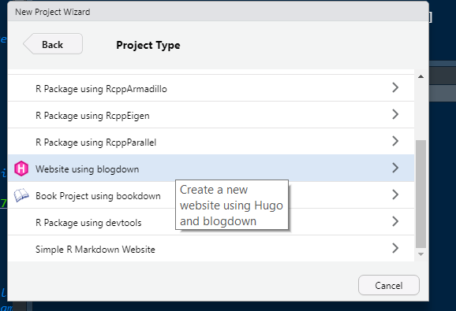
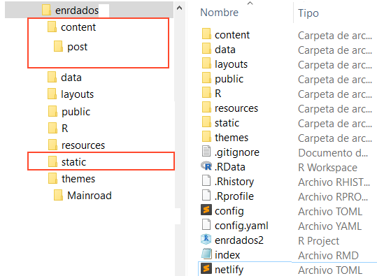

## Actualizar el Rblog

Empecé este Rblog hace 2 años y medio, el tiempo pasa rápido y esto en cosas informáticas es además una carga adicional de trabajo, pues cuando ya tienes un flujo de trabajo apañado, aparecen actualizaciones de seguridad, cambios de formatos etc, que hacen que pase la mayor parte del tiempo dedicado al blog cosiendo remiendos para que la máquina siga funcionando.

Hasta este lluvioso fin de semana de mayo, que me he cansado y he decidido tirar el pantalón viejo y comprar unos nuevos. Esto para los lectores de este *R*incón de la web será casi imperceptible, pero internamente he realizado una actualización completa del blog.

Hecho el traje nuevo voy a aprovechar para explicar cómo es esto de hacer un blog con R, cómo actualizar la plantilla sin morir en el intento, y algunos trucos que para mi son básicos y nada fáciles de resolver sin ayuda... empecemos.

## Crear un Rblog desde cero
Los primeros artículos hace ya 2 años, fueron precisamente para explicar cómo hacer un blog desde RSTUDIO usando herramientas gratuitas y libres. Puedes echar un vistazo [aquí](../crear-un-blog-con-blogdown-1) y [aquí](../crear-un-blog-con-blogdown-2).

En resumen, lo que hacemos es:
 1. abrir RSTUDIO
 2. Instalar la librería `blogdown`
 2. actualizar *Hugo* así `blogdown::update_hugo()`
 3. Elegir e instalar la plantilla web [Hugo](https://themes.gohugo.io/), vía `blogdown::install_hugo(theme = 'user/repo')`
 4. Instalar *Git*
 5. abrir cuenta en github
 6. abrir cuenta en un servidor web, como *Netlify* y enlazar esta cuenta con *github* para que automáticamente se publique la web tras cualquier cambio.


*Hugo* es un repositorio de plantillas libres para webs. Blogdown facilita mucho la integración con R y RSTUDIO, pero en este mundillo los problemas te los dan las plantillas ya que cada una es diferente y hay que personalizar muchas cosas. De hecho no todas las plantillas de Hugo funcionan con `blogdown`, es cuestión de probar la que te guste y luego echarle horas.

En mi caso me gustó una llamada [Mainroad](https://github.com/Vimux/Mainroad). Así que voy al menú de RSTUDIO --> Nuevo Proyecto y creo uno basado en blogdown indicándole la ruta a esta plantilla. También lo puedes hacer directamente desde la consola -una vez estás en un nuevo proyecto- así `blogdown::install_hugo("Vimux/Mainroad")`.



Con esto conseguimos descargar en el nuevo proyecto de RSTUDIO la plantilla inicial del blog (con los directorios y subdirectorios básicos incluidos). 

## Estructura de directorios en blogdown
Aunque cada plantilla de *Hugo* es diferente, la estructura de directorios del blog en blogdown es siempre esta:



En el directorio raíz hay unos pocos ficheros, el principal es `config.toml` que es donde se personaliza la plantilla *Hugo*. Esto se explica bien [en el manual de blogdown](https://bookdown.org/yihui/blogdown/themes.html#the-default-theme). Aunque además habrá que investigar la web del desarrollador del *theme* que uses y ver qué añadidos o particularidades tiene la plantilla.

En el directorio *theme* se almacenan los ficheros de formato, en el *static* ficheros de imágenes o bases de datos comunes a varios post y en *content* es donde se guardan los post y en general el contenido del blog.

## Actualizar el theme
En principio, para actualizar la plantilla de un blog es cambiar directorio *theme* con el nuevo, lo que haríamos con `install_theme(user_nuevo_theme/ruta)`, pero esto no suele funcionar y lo mejor es hacerlo creando un nuevo *site* completo ya que cada plantilla es diferente y cambia el árbol de directorios y el `config.toml`.

Por ejemplo, en mi caso que solo voy a actualizar al mismo `theme`, pero a la ultima versión, lo que hice fue empezar de cero un proyecto:

1. `blogdown::new_site(theme = "vimux/mainroad")`
2. después borré la carpeta `content` del nuevo proyecto y copié en ella todos ficheros y subdirectorios (como `post`) de la misma carpeta del anterior blog ( con todos los `*.Rmd|*.md|*.Rmarkdown`), también todo el contenido de la carpeta `static`.
3. Hecho esto si ejecuto `blogdown::serve_site()` en local y la previsualización es buena, es que todo ha ido bien.
4. Después hay que conectar y subir la actualización o el nuevo site a *github*. Como github está conectado con *netlify* tras subirlo se hace el deploy y en un rato tenemos la nueva web lista en línea.

Además de instalar la última versión de la plantilla he aprovechado para algunas actualizaciones como:

## RSS feed
Una de las cosas que le faltaba al blog y que no viene con la plantilla que uso es un **rss feed** que te exigen algunas web como R-bloggers. Para hacerlo he tenido que tocar algunos ficheros del `theme` así:

1. he creado el fichero `*rss.xml` en el directorio `themes/Mainroad/layouts/_default`.
2. he copiado dentro de este fichero el código que dicen en la web oficial de Hugo (<https://github.com/gohugoio/hugo/blob/master/tpl/tplimpl/embedded/templates/_default/rss.xml>).
3. Luego he cambiado en este fichero `{{ .Summary | html }}` por esto para que ponga el contenido completo `{{ .Content | html }}` en lugar del resumen.
4. no te olvides de poner la `baseurl` es decir la URL de la web en el `config.toml`

En mi caso he añadido además un botón en el menú lateral para el *feed*, Esto lo he conseguido añadiendo al `config.toml` lo siguiente:

````
[Params.widgets.social]
  social_rss = "RSS_feed"

[[Params.widgets.social.custom]]
  title = "RSS feed"
  url = "https://enrdados.netlify.com/index.xml"
  icon = "svg/rss.svg"
````

El icono es una imagen `svg` que son vectoriales en formato xml. En la plantilla mainroad hay que poner el fichero que contiene el icono  `rss.svg` dentro de `theme/Mainroad/layouts/partials/svg/`. El contenido de este fichero es este:

````
<svg class="widget-social__link-icon icon-mail" viewBox="0 0 24 24" width="24" height="24" xmlns="http://www.w3.org/2000/svg" fill="#fff"><path d="M0 0v24h24v-24h-24zm6.168 20c-1.197 0-2.168-.969-2.168-2.165s.971-2.165 2.168-2.165 2.167.969 2.167 2.165-.97 2.165-2.167 2.165zm5.18 0c-.041-4.029-3.314-7.298-7.348-7.339v-3.207c5.814.041 10.518 4.739 10.56 10.546h-3.212zm5.441 0c-.021-7.063-5.736-12.761-12.789-12.792v-3.208c8.83.031 15.98 7.179 16 16h-3.211z"></path></svg>
````

## Resaltado de sintaxis

Otro tema complejo es ajustar el resaltado de sintaxis (*Syntax Highlight*) en la plantilla. 

En algunas plantillas es más sencillo y se puede hacer directamente en el fichero `config.toml` con un par de líneas, pero en este no y me ha costado bastante arreglarlo aunque la solución es parecida a la que di en su día [2019- resaltado de sintaxis en el blog](../resaltar-sintaxis).

Si quieres evitar estos problemas elige una plantilla (*theme*) que sea compatible como por ejemplo la que usa por defecto `blogdown` [hugo-lithium](https://github.com/yihui/hugo-lithium). Para este caso es bastante fácil y basta con añadir estas lineas al config.toml:

```{yaml}
highlightjsVersion = "10.7.2"
highlightjsCDN = "//cdnjs.cloudflare.com/ajax/libs"
highlightjsLang = ["r", "yaml"]
highlightjsTheme = "Monokai"
```
Todos los resaltados se hacen con la ayuda de `Highlight.js` que es una librería `javascript` específica para esto. 

Para elegir el formato hay que irse a esta web <https://highlightjs.org/static/demo/>, y seleccionar el lenguaje (arriba), y el *theme* (abajo). Aparecerá directamente la muestra de cómo se verá el resaltado en la parte central.

En mi caso quiero resaltar el lenguaje "r" (`highlightjsLang`) y usar el *theme* con formato "Monokai" (`highlightjsTheme`).

En Mainroad hay que hacerlo así:

1. añadir este link al encabezado del fichero `head.html` que en Mainroad está en `.layouts/partial`: ` <link href="//cdnjs.cloudflare.com/ajax/libs/highlight.js/10.7.2/styles/monokai.min.css" rel="stylesheet">`. Si queremos otro formato distinto de *monokai* simplemente cambiamos el nombre del fichero al que apunta `monokai.min.css` por otro por ejemplo: `hybrid.min.css`.
2. también hay que añadir otro código al fichero `footer.html` de la plantilla:

```{yaml}
<script src="//cdnjs.cloudflare.com/ajax/libs/highlight.js/10.7.2/highlight.min.js"></script>
<script src="//cdnjs.cloudflare.com/ajax/libs/highlight.js/10.7.2/languages/r.min.js"></script>
<script src="//cdnjs.cloudflare.com/ajax/libs/highlight.js/10.7.2/languages/yaml.min.js"></script>
<script>
hljs.configure({languages: []});
hljs.initHighlightingOnLoad();
</script>
<script>
hljs.configure({languages: []});
hljs.initHighlightingOnLoad();
</script>
```

Lo malo es que hay que repetir estos cambios cada vez que se actualice la librería `Highlight.js` , aunque es fácil y solo habrá que editar los enlaces a la nueva ruta cambiando el número de versión: `10.7.2` por el nuevo.


