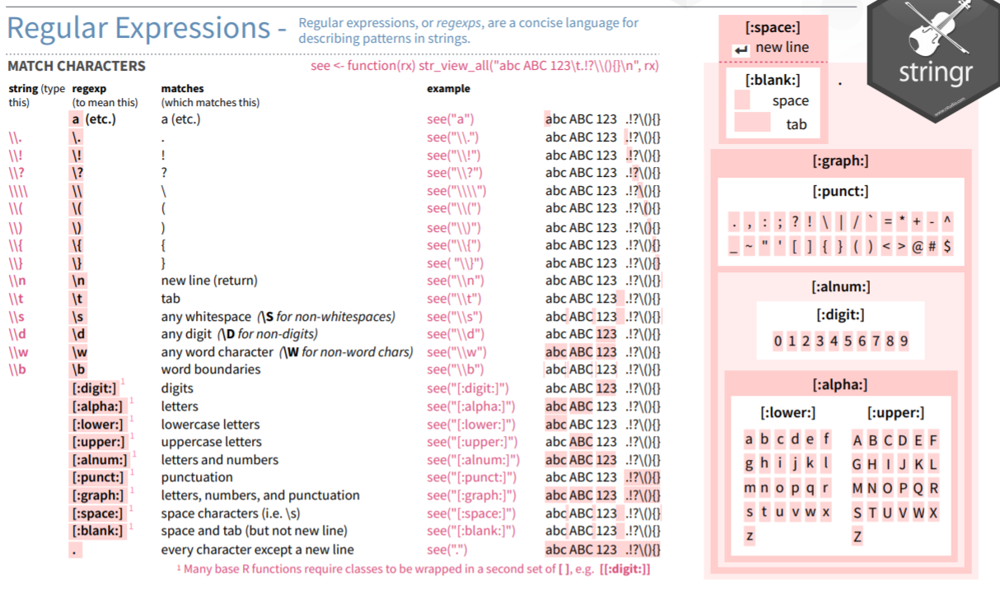

```{r setup, include=FALSE}
knitr::opts_chunk$set(error=FALSE,echo = TRUE, warning = FALSE, message = FALSE)

``` 

Vamos a ver cómo leer un documento pdf desde R con la librería `pdftools`. Se trata de un paquete interesante para leer pdf vectoriales, es decir, los que contienen texto vectorizado, esto no nos vale para archivos *pdf* tipo imagen, que son aquellos que -aunque contengan texto-, este se guarda como imagen sin vectorizar. En estos casos hay otras librerías que hacen el *OCR*, conversión y lectura previo necesario, como `tabulazer` o la librería `imageR`, aunque necesitas tener Java para esto los resultados son espectaculares. Las funciones OCR están disponibles en otras librerías de rOpenSci como el paquete `tesseract`. 

Como quiero mostrar un ejemplo sencillo, pero completo, vamos a usar una tabla descargada al azar de una web pública. Por proximidad he descargado un listado de notas del conservatorio de mi localidad que está en pdf y lo vamos a pasar a un data frame de R.

Vamos a la faena:

## pdftools

Lo primero es instalar la librería `pdftools`, que al estar en CRAN es un paso simple. Tambian puedes buscar en la web de desarrollo [aquí](https://github.com/ropensci/pdftools).

Usaremos la función tubería de `tidyverse` y las librerías `stringr` para expresiones regulares y `purrr` para listas.

El fichero pdf del que queremos extraer los datos lo he almacenado en el directorio local de trabajo y se llama *"Listado de notas Prep. 2021.pdf"*.

Con la función que vamos a usar de `pdftools` es `pdf_text()` que  convierte el pdf a texto. Almacena el documento como una lista en la que cada página del pdf es un elememnto nuevo de la lista.

Para distinguir las líneas de cada página usaremos la función `str_split` del paquete de manejo de textos `stringr`.

```{r}
library(tidyverse)
library(stringr)
library(pdftools)

# leemos las paginas del pdf una a una y separamos por filas
fich_pdf<-pdf_text("Listado de notas Prep. 2021.pdf") %>% 
   str_split("\n")

str(fich_pdf)
# numero de paginas del documento
length(fich_pdf) # longitud de la lista
# numero de lineas por pag
lengths(fich_pdf) # longitud de cada elemento de la lista
# vemos el principio de la pag 1
head(fich_pdf[[1]],10)
```

Si visualizamos la variable `fich_pdf` veremos que hay varias líneas tanto al principio como al final que contienen encabezados y cosas que no nos interesa, pues el objetivo es leer la tabla de alumnos con su nota.

Las eliminamos directamente de la variable y nos quedamos solo con las líneas de cada página que contienen datos. Hemos empezado borrando las líneas finales para que no cambie la numeración de la variable. 

Después unimos los elementos de la lista en una única variable usando `unlist`, ya que tenemos datos en la pagina 1 y en la 2 como dos elementos distintos de una lista y lo queremos como una *data.frame*. La función `str_squish` es otra función de `stringr` para tratamiento de textos que básicamente suprime los espacios sobrantes o repetidos.

```{r}
# me quedo solo con líneas de datos de la tabla
#Ojo primero las de abajo para no cambiar la numeracion
fich_pdf[[1]] <- fich_pdf[[1]][-41:-46]
fich_pdf[[1]] <- fich_pdf[[1]][-1:-8]
# ahora la pagina 2
fich_pdf[[2]] <- fich_pdf[[2]][-13:-34]
fich_pdf[[2]] <- fich_pdf[[2]][-1:-4]

#juntamos todo en un data frame
# quitamos espacios sobrantes con str_squish
aux<-unlist(fich_pdf) %>% str_squish()
#quito primera linea
aux<-aux[-1]
head(aux)
```

## sacar un data frame de datos

Con esto ya tenemos la tabla extraída del pdf, aunque en formato texto -como líneas de caracteres-. Para extraer los datos de manera útil debemos trabajar un poco más. Para esto vamos a usar las poderosísimas **expresiones regulares** o **REGEXP** (de "REGgular EXPressions").

Se trata simplemente de una formulación estandar para separar o seleccionar parte de los caracteres de un texto. Para esto se usan expresiones *tipo* que las funciones de procesamiento de textos interpretan de forma homogénea. El problema con estas REGEXP es que son algo difíciles de entender a la primera, es mejor verlo con ejemplos.



Por ejemplo en nuestro caso tenemos un vector llamado aux, en el que hemos almacenado cada línea de una tabla en formato texto. Todas las líneas comienzan con un número (de orden) y tras este primer número hay un punto. Pues con la expresión siguiente: `"[[:digit:]]+(?=\\.)"` conseguimos diferenciar estos números iniciales al decir a R que busque en cada línea varios digitos `[[:digit:]]+` (el + indica que son mas de uno) que después finalizan con un punto  `(?=\\.)`.

Las dos barras indican un caracter especial y el símbolo (=?) se usa para decir que finaliza o (<=?) que va delante.

En esta web tienes una [chuleta con estas expresiones](https://evoldyn.gitlab.io/evomics-2018/ref-sheets/R_strings.pdf) que hay que tener a mano cuando trabajas cosas de texto.
Vamos a extraer con regexp los datos que necesitanos:

```{r}
# almacenamos en el vector num los números de línea
num<-aux %>% str_extract("[[:digit:]]+(?=\\.)")

# sacamos los apellidos:
#     está precedido por . y espacio y finalizan con coma , mas un espacio
apellido<-aux %>% str_extract("(?<=\\.\\s)[[:print:]]+(?=\\,\\s)")

# quito las variables ya leidas del vector
aux1<-str_squish(substring(aux, first = 4)) 
aux1<-str_replace_all( aux1, apellido,"" )
# quito la coma y espacio
aux1<-substring(aux1, first = 3)

# Extraigo el nombre:
# el nombre comienza con la coma y espacio y finaliza con espacio y digito y coma seguidos
nom<-aux1 %>% str_extract("[[:print:]]+(?=\\s[[:digit:]]\\,)")
aux1<-str_replace_all( aux1, nom,"" ) # lo quito de aux1 el nombre
aux1<-str_squish(aux1) # quitamos espacios sobrantes
# vemos el resultado
head(aux1)
```

Así vamos leyendo cada variable que nos interesa y extrayendo del texto datos.
Las variables que nos quedan son la nota y la fecha de nacimiento. Separadas por un espacio por lo que podemos usar `strsplit`, pero ojo, esta función crear una lista para cada elemento.
Para extraer el primero elemento de cada uno de los elementos de la lista vamos a usar las funciones `map` del paquete `purrr` que ya tenemos en memoria pues es de tidyverse.
Estas funciones son súper útiles para el manejo de listas como vimos aquí [chuleta-de-purrr](../chuleta-de-purrr).

```{r}
aux2<-aux1 %>% strsplit(split= " ")
walk(aux2[1:6],print) # vemos los 6 primeros elementos
# extraemos el primer elemento de cada elemento de la lista
nota<-map_chr(aux2,~.x[[1]])
#cambiamos coma por punto porque tengo configuracion de decimal como punto
nota<-as.double(str_replace(nota,",","."))

# Extraemos la fecha que es el segundo elemento de cada elemento de la lista
# y le damos formato de fecha adecuada
fecha<-as.Date(map_chr(aux2,~.x[[2]]),"%d/%m/%Y")

```

Con esto ya tenemos todas las variables, así que lo juntamos en un data frame y listo reto conseguido!!!.

```{r}
# por último ya tenemos los datos de tabla al completo
# y creamos el data.frame final
tabla<-data.frame(id=num,apellido=apellido,nombre=nom,nota=nota,fecha=fecha)
head(tabla)
```
Espero que os haya gustado el post, un saludo veraniego!!

