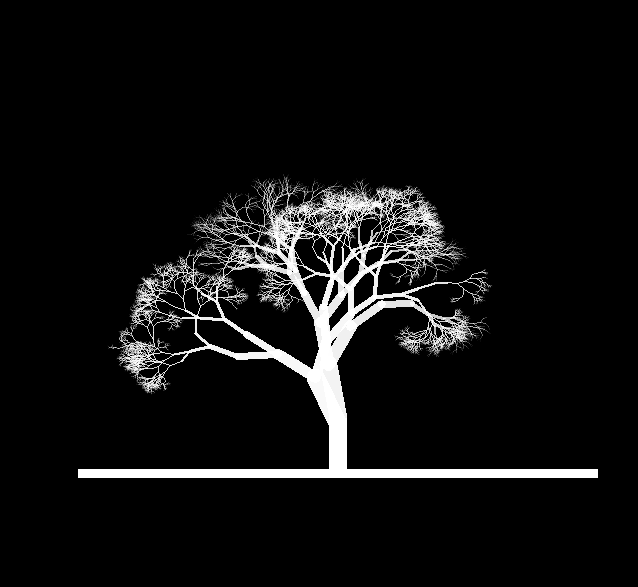

```{r setup, include=FALSE}
knitr::opts_chunk$set(error=FALSE,echo = TRUE, warning = FALSE, message = FALSE)
#
``` 

## Arte generativo con R

Hace un par de post hablamos de la generación de números aleatorios [ver aquí](../2021-06-14-generacion-aleatoria), y hoy vuelvo a insistir en este tema fascinante que me embruja sin remedio. En cierta forma, lo que me atrae es la belleza del caos, la incomprensión de cómo una sucesión espontánea y aleatoria de números puede llegar a transformarse en objetos cotidianos y naturales de increíble belleza.

Esto es especialmente visible en los seres vivos, que muestran una geometría compleja , caótica y de una belleza sublime que a la vista de experimentos como el que vamos a realizar puede ser fruto del puro azar.

Hoy vamos a crear una función que hace formas arbóreas fractales con con un método muy simple, las funciones recursivas.

## Algoritmo

La idea es la siguiente: partiremos de un punto en el plano -la base del tronco- y dibujamos ahí una línea vertical. Luego a partir de ese punto vamos dibujando ramas cada con líneas.

Creamos una función llamada `ramas()` que tiene de argumentos el punto de inicio de la rama, la longitud, anchura y ángulo de la rama. Se trata de una simple función de pintar líneas, a la que vamos a llamar de forma recursiva una y otra vez en cada bifurcación. 

En nuestro experimento solo hacemos bifurcaciones, pero si quieres prueba a poner la posibilidad de dividir en 1,2 o 3 ramas en cada bifurcación, aunque esto aumenta sobremanera las ramas y satura la memoria del PC a poco que te descuides.


```{r funciones}
####################################
######## Función que pinta el arbol    
parbol <-
  function(h = 100,  # altura media del arbol
           ramificacion = 50,# posición de x0 del tronco en principio h/2
           base = h / 2,# a mayor valor más ramas y más complejo
           colort = "white", # color 
           sobreescribe = NULL) { # si no es null pinta encima del lienzo
  # si es NULL pinta en un lienzo nuevo
    if (is.null(sobreescribe)) {
      #pinta el lienzo en blanco
      plot(
        1:h,
        type = "n",
        xlim = c(0, h),
        ylim = c(0, h),
        xlab = " ",
        ylab = " "
      )
    }
    # calculo de variables:
    largo <- runif(1, h / 10, h / 5) # altura tronco
    ancho <- sample(6:25, 1)  # ancho tronco
    angulo_rama = pi / 2 # angulo de rama inicial 90
    # puntos xy de la linea del tronco principal
    x1 = base
    y1 = 0
    x2 = base
    y2 = largo
    # pintamos el tronco en las coordenadas x1,x2  y1,y2
    # ajuste de color del arbol
    col01 <- adjustcolor(colort, alpha.f = 1)
    abline(h = 0, lwd = ancho / 2, col = col01) #linea de suelo
    # tronco base; lend indica la forma de extremo de linea (par)
    lines(c(x1, x2),
          c(y1, y2),
          lwd = ancho,
          col = col01,
          lend = 1)
    angle1 <- angulo_rama + rnorm(1) * pi / 16 # angulo de la siguiente parte del tronco
    
    # Llama a la función de creación de las ramas a partir del punto
    # final del tronco
    ramas(c(x2, y2), ancho, largo, angle1, h / ramificacion, color = colort)
  }

####################################
######## Funcion que pinta las ramas
ramas <- function(pini,# pini= punto inicio linea rama c(x,y)
                  w,   # w= ancho de la rama
                  l,   # l= largo de la rama
                  ang, # ang= angulo de la rama
                  lmin_rama = 10,# lmin_rama= limite min de long de rama recomendado h/50
                  color = "white") {

  x1 = pini[1] - l * cos(ang)
  y1 = pini[2] + l * sin(ang)
  pfin = c(x1, y1)
  # color de las ramas que va aumentando el alfa en las hojas
  col01 <- adjustcolor(color, alpha.f = 1.5 - lmin_rama / l)
  
  # pinta la linea con los datos dados
  lines(c(pini[1], pfin[1]),
        c(pini[2], pfin[2]),
        lwd = w,
        col = col01)
  # Calcula la siguiente bifurcación:
  dif <- pi / 2 #- (pi / 16)
  angle1 <- ang + runif(1, 0, dif) / 2
  angle2 <- ang - runif(1, 0, dif) / 2
  # calcula aleatoriamente un nuevo grueso y largo de las ramas bifurcadas
  n_ancho = runif(1, w * 0.6, w * 0.8)
  n_largo = runif(1, l * 0.7, l * 0.9)
  
  # Controla el crecimiento recursivo hasta el limite min de rama
  if (n_largo < lmin_rama) {
    # sale del loop, fin de función
  } else {
    # pinta las nuevas ramas de la bifurcación
    ramas(pfin, n_ancho, n_largo, angle1, lmin_rama, col = col01)
    
    if (runif(1) > 0.3) {
      # un 30% de las veces no se bifurcará
      ramas(pfin, n_ancho, n_largo, angle2, lmin_rama, col = col01)
    }
  }
}

```
Una vez hemos definido estas dos funciones veamos un ejemplo de uso, el primero con los valores por defecto y en el segundo cambiamos el fondo del lienzo a negro y las ramas a blanco:

```{r}
# Creo un arbol de altura 100
parbol(120,150,color="black")
parbol(120,150,base=20,color="black",sobreescribe=1)

# Cambio el fondo a negro
par(bg = 'black')
parbol(100,150)
parbol(100,200,sobreescribe=1)
```

Las funciones recursivas suelen dar problemas con la memoria de trabajo del sistema. Son lentas cuando llegan a un ponto de explosión esponencial por lo que hay que tener cierto cuidado en no pasarse y limitar el bucle.

Si intentas reproducir este código, empieza con un valor pequeño del parámetro `ramificacion` como 15 y ve aumentando este parámetro poco a poco. Si notas que se ralentiza mucho el resultado ya sabes donde tienes el límite.

## Conclusiones
  
Si te ha gustado este experimento, prueba a hacer una aplicación shiny en la que los argumentos sean variables con input, y así podrás ver cómo afecta cada uno a la forma.

Hace un tiempo escribí un post en el que dibujábamos un bosque en R, con otras funciones y propósito, pero [aquí está si quieres echar un vistazo](../hacer-un-bosque-con-r)
Lluego generamos una 
