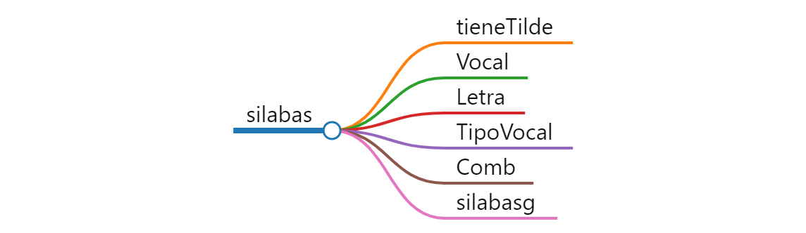

```{r setup, include=FALSE}
knitr::opts_chunk$set(error=FALSE,echo = TRUE, warning = FALSE, message = FALSE)
```

El año pasado hice un programaita simple para ayudar a los pequeños poetas, lo llamé [rimador](../2021-03-03-rimador-nube). Se trataba de escribir una palabra y el programa buscaba otras con la misma terminación o *rima*, según algunos parámetros. Así, podías buscar palabras que rimaran solo en las vocales últimas o en rima exacta consonante.

El caso es que no encontré ningún paquete, ni función con el que calcular la **división en sílabas en español** y que permita calcular estas rimas.

Hay alguna función que se usa para guionado (*hyphen* en inglés), que es cortar una palabra al final de línea por un guión y seguir en la de abajo, como *hyphenate* de la librería *hyphenatr*. Estas funciones no son nada buenas para nuestro bello y complejo idioma castellano..

Tenía pendiente programar una función de silabeo mejor, y bueno, al fin saqué un rato para pasar los apuntes y salió esta que les muestro aquí, por si les hace falta. Quizás alguno la necesite para hacer eso que está tan de moda del *Natural Language Processing* con R. En tal caso solo les pido que lo comenten aquí abajo ⬇️.

La verdad que esta funcioncita no lo hace nada mal, y hasta el momento no le vi fallos.

Lo ideal sería meterla en un paquete, pero eso mejor otro día, que ando fatal de tiempo como habrán comprobado los seguidores de este pequeño blog.

Por cierto, he dejado una versión en línea del [rimador aquí](https://nolugar.shinyapps.io/nube_rimas2/), así que ya no hay excusa para los poetas perezosos, ¡pruébalo!.

## Función silabeo en Castellano

Básicamente la función *silabas()* toma una palabra y devuelve un vector con las sílabas de dicha palabra. También está la opción de que devuelva la palabra separando las sílabas con guiones *silaba()*.

Además de la función base, he programado 4 funciones auxiliares que ayudan en el proceso identificando si una vocal tiene tilde o no con la función (*tieneTilde*), o si un carácter es o no vocal  con *Vocal*. La función *Letra* distingue si el carácter de entrada es un símbolo o una letra. *TipoVocal* diferencia vocales abiertas de cerradas y *Comb* busca combinaciones de 2 consonantes en castellano que forman parte de una misma sílaba.




## Código

El código se muestra a continuación, para usarlo, una vez cargadas todas las funciones prueba a hacer esto `silaba(mariposa)` o ` silabag(mariposa)` y verás el resultado.


```{r}
#####################################################
# Funciones para silabear una palabra en castellano #
# Autor: Fernando Villalba Bergado                  #
#        www.enRdados.net                           #
#####################################################

library(stringr) 

# Función que es TRUE si es una vocal acentuada con tilde
tieneTilde <- function(c) {
  c = tolower(c)
  tildes = c("á", "é", "í", "ó", "ú")
  if (c %in%  tildes) {
      return(T)
  } else{
      return(F)
  }
}

#Vocal= Funcion que determina si es o no vocal un caracter
Vocal <- function(c) {
  V = T
  c = tolower(c) #LCase(c)
  vocales = c("a", "á", "e", "é", "i", "í", "o", "ó", "u", "ú", "ü")
  if (c %in%  vocales) {
    V = T
  } else{
    V = F
  }
  return(V)
}

# Funcion que dice si es vocal abierta o cerrada
TipoVocal <- function(c) {
  # 0 = no es vocal
  # 1 = vocal abierta
  # -1 = vocal cerrada
  V = 0 # si no es vocal
  c = tolower(c) #pasa a minúscula
  if (Vocal(c)) {
    v_cerrada = c("i", "í", "u", "ú", "ü")
    if (c %in%  v_cerrada) {
      V = -1
    } else{
      V = 1
    } 
  }
  return(V)
  #Ejemplo: TipoVocal("a")
}

# Letra = funcion que nos dice si es una letra = True o no (puede ser un símbolo)
Letra <- function(c) {
  l = F
  c = tolower(c) # pasa a minúscula
  if ((c >= "a" &  c <= "z" | c == "ñ") |
      (c == "á" |  c == "é" | c == "í" | c == "ó" | c == "ú" | c == "ü")
      ) {
    l = T
  } else{
    l = F
  }
  
  return(l)
}

# Comb = funcion que nos dice si las letras seleccionadas son alguna de las combinaciones de consonantes marcadas
Comb <- function(c) {
  Cmb = T
  c = tolower(c)
  combi <-
    c("bl","br",
      "cl","cr",
      "dl","dr",
      "fl","fr",
      "gl","gr",
      "pl","pr",
      "tl","tr",
      "kl","kr",
      "ll","rr",
      "ch","qu"
    )
  if (c %in%  combi) {
    Cmb = T
  } else{
    Cmb = F
  } #-1=cerrada
  return(Cmb)
}


silabas <- function(miP) {
  V = 0
  S = ""
  A = ""
  Sig = ""
  l = nchar(miP) #str_length(miP)
  miP = str_trim(miP)
  Va = F
  silabas = c(NULL)
  #if(miP !="palabra"){1}else{2}
  if (miP != "") {
    for (i in seq.int(from = l, to = 1)) {
      Ta = F # T de antes
      c = str_sub(miP, i, i) # c = substring(miP, i, i)
      Vc = Vocal(c)
      Vs = Vocal(Sig)
      Tvc = TipoVocal(c)
      Tvs = TipoVocal(Sig)
      Cmb = paste0(c, Sig)
      if (Vc & !Vs) {
        V = V + 1
      }
      if (V > 1 & !Vs) {
        Ta = T
      }
      else if ((!Vc & !Vs & !Comb(Cmb)) & (V = 1 & i > 1)) {
        Ta = T
      }
    #  if((TipoVocal("a") == -1 & tieneTilde("í") & TipoVocal("í"))){1}
      else if ((Tvc == 1 & Tvs == 1) |
               (Tvc == -1 & tieneTilde(c) & Vs) |
               (Tvc == 1 & (Tvs == -1 & tieneTilde(Sig))) |
               ((Vc & Vs) & (c == Sig))) {
        Ta = T
        V = V + 1
      }
      if (Ta == T) {
        #Añade la nueva sílaba
        if(S !=""){silabas = c(S, silabas)}
        #silabas = c(S, silabas) #append(silabas,S)
        S = c
        V = V - 1
      } else{
        S = paste0(c, S)
      }
      Sig = c
    }
    #Añade la nueva sílaba
    #silabas = c(S, silabas)
    if(S !=""){silabas = c(S, silabas)}
  } else{
    return(F) # si no es correcto 
  }
  return(silabas)
}

#silabasg = funcion que calcula las sílabas de una palabra separada por guiones
silabasg<-function(c){
  paste(silabas(c),collapse="-") 
}

# Vamos a probar
silabas("campana")
silabasg("mariposa")
silabasg("frágil")
```


