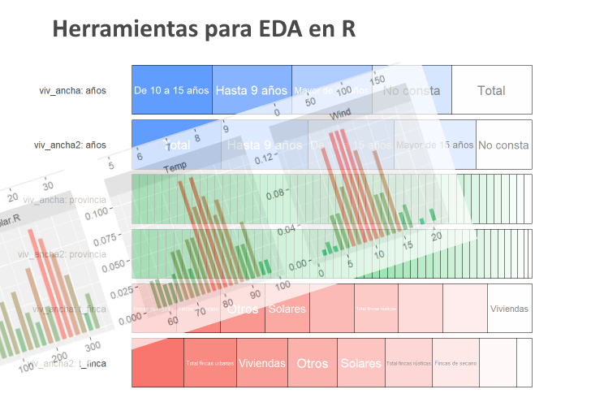
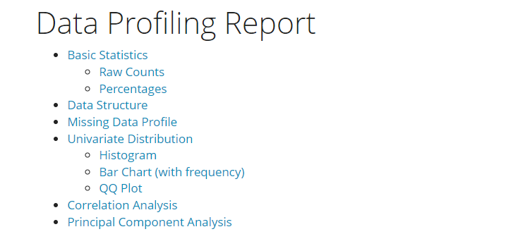
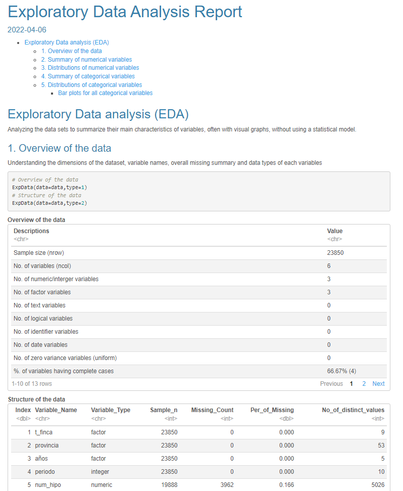
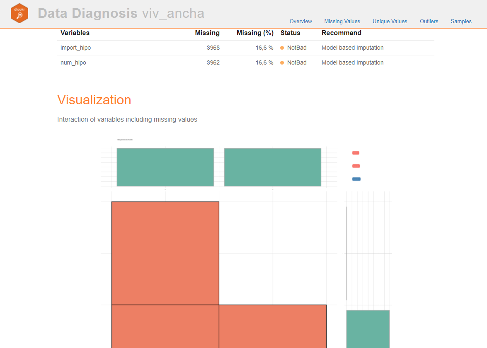

```{r setup, include=FALSE}
knitr::opts_chunk$set(error=FALSE,echo = TRUE, warning = FALSE, message = FALSE)
#
```

## Exploratory Data Analisys con R {#eda1}

Llamamos Análisis Exploratorio de Datos (acrónimo **EDA** del inglés) al proceso inicial de reconocimiento o, lo que sencillamente entendemos como **echar un vistazo** a los datos y así empezar a comprender un poco lo que contienen y qué se puede hacer con ellos.

He dividido el artículo en 3 partes, en la primera vemos *"lo básico"* e imprescindible que son las funciones de *RBase* para echar un vistazo a los datos tabulados. En la [segunda parte](#p2) hablamos de las librerías especícifas para *EDA* que aportan gran valor al simplificar procesos, gráficas y en general facilitar el primer contacto con datos tabulados para su mejor comprensión. En concreto veremos los paquetes `skimr`, `visdat` y el que más me gusta `inspecdf`.

En la [3º parte](#p3) os indico, sin entrar en mucho detalle, algunos paquetes que hacen *EDA* de forma automatizada generando completos informes con un click.

# Introducción. Trabajar con tablas {#intro}

Una tabla es un conjunto estructurado de datos ordenados en filas (registros) y columnas (variables).

Antes de empezar a usar una tabla en nuestros análisis, lo primero que debemos comprobar es que se trata de **datos procesados**, es decir, que cumplen estas 5 reglas:

1.  cada variable debe estar en una sola columna
2.  cada observación debe estar en una fila diferente
3.  debe haber una tabla para cada tipo de variables
4.  cada variable o columna debe tener un nombre y este debe tener sentido.
5.  cada tabla debe estar en un fichero diferente.

Lo habitual, es que **NO LOS CUMPLA**, y tengamos que trabajar sobre los *datos brutos* hasta obtener una tabla de *datos procesados*.  En este post veremos, como ejemplo, las funciones para pasar de tabla larga a tabla ancha para cumplir estas reglas.

## Obtención de datos

Para ver un caso real de verdad y no la típica tabla de ejemplo de una librería os propongo buscar datos en alguna de estas webs:

-   [kaggle](https://www.kaggle.com/) es una web que ofrece *open data*
-   [10-datasets-kids](https://www.littlemissdata.com/blog/10-datasets-kids)
-   La EU ofrece datos y tablas en abierto "oficiales" <https://data.europa.eu/es>
-   Datos económicos del[banco muncial](https://datacatalog.worldbank.org/search?q=spain&sort=last_updated_date%20desc)
-   [google researche](https://datasetsearch.research.google.com/)
-   [Gobierno de España](https://datos.gob.es/)

### Descarga de datos de trabajo

Para nuestro ejemplo vamos a usar datos de compra-venta de viviendas en España que he encontrado en la web de datos abiertos del Gobierno de España [aquí](https://datos.gob.es/es/catalogo/ea0010587-hipotecas-anuales-por-naturaleza-de-la-finca-provincias-duracion-en-anos-y-numero-e-importe-hpt-identificador-api-3240).

Podemos descargar el fichero directamente de la web con formato `csv` o copiar el enlace a R y bajarlo con código como explico en el bloque siguiente. Usamos la función `read.csv()` para leer el fichero descargado.

```{r eval=FALSE}
# descarga de datos directamente con R
library(RCurl)
viv<-getURL("https://www.ine.es/jaxiT3/files/t/es/csv_bdsc/3240.csv")
```

```{r echo=FALSE}
#ocultamos este code chunk para aparentar que lo lee de la web
#viv<-file.choose()  # caso de que lo hayamos descargado, lo buscamos en ficheros
#viv_df<-read.csv("3240.csv",header = T,sep = ";",strip.white = TRUE,stringsAsFactors = F, encoding="UTF-8")

#saveRDS(viv_df, file = "viviendas.rds")
# Restore the object
viv_df<-readRDS(file = "viv_df.rds")
```

```{r eval=FALSE}
# Lectura de la tabla csv a R
viv_df<-read.csv(viv,header = T,sep = ";",strip.white = TRUE,stringsAsFactors = F, encoding="UTF-8")
```

En realidad, te confieso que para leer esta tabla correctamente he tenido que descargar antes los datos y ver algunas cosas internas del fichero, como ver si tiene encabezado de las columnas (`header = T`), ver qué separador de campos usa (`sep = ";"`). También he incluido el `encoding="UTF-8"` que hace que la lectura de tildes y *eñes* del español se lean bien y no se corrompa con extraños símbolos.

Como ves, obtener los datos requiere de un proceso de prueba y error 💪 . Por eso me gusta empezar con casos reales y no con *data.frame* de prueba que traen los paquetes, que ya tienen todo masticadito y perfecto.

## Parte 1. Primer vistazo -EDA {#p1}

Ahora que tenemos la tabla bruta lo primero es echar un vistazo a los datos y para eso lo mejor es usar las funciones de *RBase* clásicas que son:

 * `str()`➡️ muestra un resumen de la estructura de la tabla
 * `head()` y `tail()` ➡️ muestra los primeros o últimos registros
 * `summary()`➡️ hace un resumen estadistico por variables
 * `glimpse()` de *dplyr* lo mismo que str, pero más compacto.
 *  `dim()` ➡️ da las dimensiones de la tabla
 *  `nrow()`,`ncol()` ➡️ el número de filas o de columnas que tiene.
 *  `table(df$col1)` ➡️  resúmenes agregados por columan  (cuenta casos
 *  `unique()`➡️ nos muestra los valores únicos (sin repeticiones) de una variable
 * `aggregate()` ➡️ una función super util para resumir y agregar datos de manera simple.
 * `View(df)` te muestra la tabla con las celdas directamente en RSTUDIO.

Veamos algún ejemplo:
```{r EDA_base}
# Primer vistazo a los datos con RBase
#str(viv_df)  # = que glimpse()
head(viv_df,3)
#tail(viv_df,3)
#summary(viv_df)
dplyr::glimpse(viv_df)
```

Con estas funciones verás que se trata de una tabla de 6 columnas y 47.700 filas. El primer problema es que los nombres de las columnas son muy largos, y esto no va bien para los futuros gráficos, así que vamos a renombrar las variables. esto se hace de una manera simple pasando un vector con los nombres nuevos ordenados:

```{r}
# Nuevos nombres de las columnas
names(viv_df)<-c( "t_finca", "provincia", "años","importe","periodo","total")
```

A mi me gusta ver una muestra aleatoria de datos y uso este pequeño truco

```{r}
# Mostrar 6 registros aleatorios
viv_df[sample(1:nrow(viv_df),6),]
```


## De tabla larga a tabla ancha

En el resumen `summary()` de los datos he visto algo raro.... si os fijais, la columna "*importe*" tiene solo dos posibles valores `r unique(viv_df$importe)` y tiene pinta de que a cada valor de *importe* le corresponde un valor de la columna *total*. Esto no cumple los principios de [datos procesados](#intro). 

Han incluido dos variables en una misma columna. Es un típico caso de *tabla larga*, que hay que pasar a *tabla ancha*. Cada uno de los dos valores únicos de la columna "*importe*" están relacionados con la columna "*total*", así que vamos a **desdoblar** esta columna en dos usando la librería `tidyr`incluida en *tidyverse* con la función `pivot_wider()` en la que decimos la columna que contiene los nombres y la columna que tiene los datos y la desdobla así creando 2 nuevas columnas.

```{r}
library(tidyverse)# tidyr
# vamos a coger los datos de nombre de la col importe y los valores de total
viv_ancha <- pivot_wider(viv_df, names_from = importe, values_from = total)
# cambiamos los nombres de las dos columnas nuevas
names(viv_ancha)[5]<-"num_hipo"
names(viv_ancha)[6]<-"import_hipo"

# Vemos algunos registros aleatorios de esta nueva tabla
viv_ancha[sample(1:nrow(viv_ancha),6),]
```

El proceso inverso se haría con la función `pivot_longer()`.

## Convertir a números los factores

Hay varias columnas numéricas que como vemos en el resumen las toma como factores o texto según hayamos usado `stringsAsFactors = T` en la lectura de los datos. El problema es que las variables numéricas no las ha interpretado como tal, quizás por el punto de los miles,así que vamos a quitarlo y transformar a numéricas.

Para hacer esto usaremos la función `gsub(patron_a_cambiar,texto_remplazo,vector)`.

```{r}
# convertimos las columnas de texto a numéricas y antes eliminamos el punto de miles
viv_ancha$import_hipo<-as.numeric(gsub("[.]", "",viv_ancha$import_hipo))
viv_ancha$num_hipo<-as.numeric(gsub("[.]", "",viv_ancha$num_hipo))

# Vemos algunos registros aleatorios
viv_ancha[sample(1:nrow(viv_ancha),6),]
```

## Valores inválidos
Ahora nos surge otro problema, y es que vemos que los datos tiene muchos valores inválidos o *NA*. Los valores inválidos hay que contarlos siempre, para estimar la calidad de la muestra y quitarlos o imputarlos (rellenar con formulación en caso de que lo creamos necesario). En nuestro ejemplo fundamentalmente los quitaremos para las gráficas, pero hay que ver cuantos hay con las funciones siguientes.

```{r}
sum(is.na(viv_ancha)) # cuenta los NAs totales
sum(complete.cases(viv_ancha)) # cuenta los casos completos de la tabla
nrow(na.omit(viv_ancha))# omite los casos inválidos y cuenta los que hay
#guardamos una nueva tabla solo con casos completos
viv_ancha2<-na.omit(viv_ancha)
```
## aggregate
Solo nos queda añadir al resumen de funciones un ejemplo de `aggregate` que para mi es una de las funciones más útiles en esta fase de ver los datos, pues nos permite hacer subtotales fácilmente.

```{r}
# calculamos el num de hipotecas por año, descontando el total nacional
aggregate(num_hipo ~ periodo,viv_ancha[!viv_ancha$provincia == "Total Nacional",],sum)
```


# Parte 2. Librerías para EDA básico {#p2}

Hemos visto las funciones básicas de R para echar un vistazo inicial a los datos, a estas funciones les podemos añadir todas las funciones gráficas que queramos, con las que poder pintar las variables y sus relaciones (como `hist()`, `plot()`, o librerías como `ggplot()`), pero en lugar de hacerlo así, dedicaremos esta 2º parte a ver paquetes *específicos para EDA* y que directamente nos dan unas buenas funciones gráficas y tablas resumen en pocas líneas de código.

## skimr
`skimr` es una librería que da un primer vistazo bueno y rápido al generar una *mini-gráfica* de histograma, así como un resumen completo por variables, pensado especialmente para verlo en pantalla y no para generar informes finales. 

```{r}
library(skimr)
skim(viv_ancha) # función principal
```
Se puede extraer cada una de las partes de este resumen:

```{r}
#resumen de valores numéricos
viv_ancha %>%
  skim() %>%
  yank("numeric")
```

## visdat

Otro paquete para ver los datos es `visdat`. Esta librería tiene una gráfica que me gusta bastante como resumen, con la función `vis_dat()`, que muestra la distribución por tipo de dato, e incluso los `NA`:

```{r}
library(visdat)

#vis_miss(viv_ancha)
vis_dat(viv_ancha)
```

## inspectdf

Como tercera opción y la que más me gusta está la librería *inspectdf* que proporciona gráficos resumen de gran calidad y concreción. La salida gráfica para las variables factores está muy conseguida y en general son intuitivos y de fácil comprensión.

Podeis encontrar más información en este fantástico [post de littlemissdata](https://www.littlemissdata.com/blog/inspectdf). Veamos varias gráficas obtenidas con esta librería aplicada directamente a algunas de las tablas que hemos procesado en el ejemplo.

```{r}
#devtools::install_github("alastairrushworth/inspectdf")
library(inspectdf)

# Graficas EDA con inspectdf sobre los datos de ejemplo
inspect_types(viv_ancha) %>% show_plot() # tipos de datos
inspect_mem(viv_ancha) %>% show_plot() # basic sizing information
inspect_na(viv_ancha) %>% show_plot() # no va
inspect_cat(viv_ancha) %>% show_plot() # ver categóricos
```
La gráfica que proporciona dividiendo por categorías es de lo mejor que he visto, muy visual y que permite un primer vistazo potente.

Las que resumen los datos numéricos también, pero en la tabla de muestra no se aprecia, así que vamos a pintar más ejemplos, pero usando la tabla `airquality` con datos de calidad del aire:

```{r}
inspect_num(airquality) %>% show_plot() # explorar los numeric
inspect_types(airquality) %>% show_plot()
inspect_num(airquality) %>% show_plot()
```

Una cosa interesante de *inspectdf* es que se puede comprar dos tablas similares, que tengan las mismas columnas y nos da gráficas muy interesantes. Por ejemplo, las tablas *viv_ancha* y *viv_ancha2* se diferencian en que quitamos los NA o inválidos, veamos como lo representa:

```{r}
# comparativa de dos tablas procesadas una sin NA
inspect_na(viv_ancha,viv_ancha2) %>% show_plot() # no va
inspect_cat(viv_ancha, viv_ancha2) %>% show_plot() # ver 
```

# Parte 3. EDA automático {#p3}

En esta tercera parte veremos paquetes que generan un informe completo y automático a partir de la tabla de datos, son la solución para tontos: *pulse el botón rojo y listo* 😜.

En realidad estas librerías son excelentes cuando tenemos unos datos de partida complejos con muchas columnas y registros, pues dan una salida resumen rápida y estructurada con excelentes gráficas, perfectas para copiar en informes.

## DataExplorer

`DataExplorer` es la librería más conocida para análisis exploratorio *EDA*. Es muy simple y ofrece una salida -tipo informe- que aporta muchísima información. Su uso es tan fácil que asusta, solo cargamos la librería y llamamos la función `create_report` sobre la tabla que queremos ver.

```{r, eval=FALSE, echo=TRUE}
library(DataExplorer)
# llamada a la función informe automático
create_report(viv_ancha)
```

Lo que hace la función `create_report` es generar un documento en formato *html* llamado *report.html* que se guarda en el directorio de trabajo (si no sabes cual es usa `getwd()`). Si abrimos ese fichero veremos un completo análisis cuyo indice es el siguiente:



Cada una de las gráficas y tablas del informe se puede hacer de forma independiente con funciones específicas de la librería, por ejemplo:

```{r}
library(DataExplorer)
introduce(viv_ancha) #tabla resumen de columnas y tipos
# gráfico intro
plot_intro(viv_ancha)
 #plot_missing(viv_ancha)
 #plot_bar(viv_ancha) # grafica de factores
plot_bar(viv_ancha,by = "t_finca") # grafica de un
 #plot_correlation(viv_ancha, maxcat = 5L) # correlacion de 5 primeras categorías
 #plot_histogram(viv_ancha)
```

Puedes encontrar más información de este paquete en:<https://cran.r-project.org/web/packages/DataExplorer/vignettes/dataexplorer-intro.html>

## SmartEDA

Otra librería parecida es `SmartEDA`, con un funcionamiento similar a `DataExplorer`, aunque tiene una diferencias muy agradecida y es que escribe el código de cada gráfica o tabla en el informe. La función principal es `ExpReport()`

```{r eval=FALSE, echo=TRUE}
library(SmartEDA)
data<- airquality
# funcioin que genera un informa completo
ExpReport(data,op_file='informeEDA.html')

# si queremos alguna gráfica o tabla por separado
ExpData(data=data,type=1)
ExpData(data=data,type=2)

ExpNumStat(data,by="A",gp=NULL,Qnt=seq(0,1,0.1),MesofShape=2,Outlier=TRUE,round=2)
# una tabla resumen con multitud de estadisticos de las variables numericas
ExpNumStat(viv_ancha,by="A",gp=NULL,round=2)
```
Esta es una imagen del informe de salida:

{width=400px}

## dlookr
Otra librería, para mi la mejor, para EDA es [dlookr](https://choonghyunryu.github.io/dlookr/). Con una simple función nos genera un completísimo informe de los datos origen en formato página web.

Además tiene mil opciones de estadísticos, gráficas o transformaciones, incluso imputación de valores NA (relleno de datos).

Vamos a poner algunos simples ejemplos. Para generar el informe completo se usa la función `diagnose_web_report()` o `eda_web_report()` según el interés ultimo que buscamos.

```{r eval=FALSE, echo=TRUE}
library(dlookr)
library(dplyr)
#library(nycflights13)# Para los datos de ejemplo 
eda_web_report(viv_ancha2)
diagnose_web_report(viv_ancha) # 
```
Una imagen del informe de salida es así:

{width=400px}

La librería tiene mil opciones de análisis y entre las funciones disponibles, aquí van algunos ejemplos:

```{r}
library(dlookr)
library(dplyr)

diagnose(viv_ancha)
describe(viv_ancha)
normality(viv_ancha)
plot_normality(viv_ancha)
plot_correlate(viv_ancha)
```

Recomendamos leer su web y la descripción de las funciones al detalle para sacar partido a esta maravilla.
