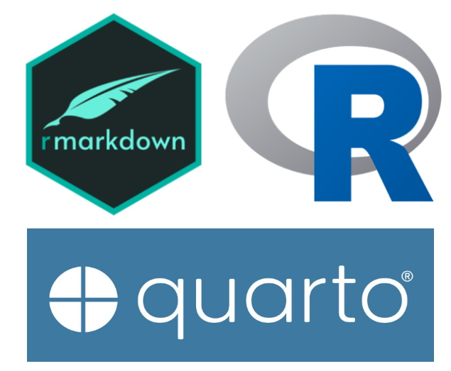

## Quarto el nuevo rMarkdown

La novedad de este verano ha sido la publicación de (Quarto)[https://quarto.org/] por RSTUDIO, que como veremos se trata de un nuevo *Rmarkdown* "mejorado".

Según parece el objetivo principal que persiguen con este nuevo lenguaje de publicación, es integrar mejoras, pero especialmente ampliar su territorio de uso a los programadores de *python*, y presentar un estándar más escalable a otros lenguajes.

El anuncio oficial del pasado 28 de julio lo puedes leer [aquí] (https://www.rstudio.com/blog/announcing-quarto-a-new-scientific-and-technical-publishing-system/).

*rMarkdown* ha sido sin duda uno de los impulsores del ecosistema R, haciendo fácil la integración de código en texto lo que simplifica la publicación de artículos y documentos en cualquier formato conocido y de calidad excelente. Rmarkdown básicamente permite integrar script de código dentro de documentos de texto que luego exportamos a pdf, Word, html o LaTeX entre muchos otros resultados.

Con rMarkdown se podían hacer desde libros a blogs de manera sencilla e integrada sin necesidad de costosos programas de edición, incluso aprovechar toda la potencia de LaTeX en su interior sin apenas trabajo de edición.

Esa facilidad para generar documentación es lo que impulsó el uso de *R* en muchas personas que no son específicamente programadores, y que buscaban una herramienta en la que pudieran presentar y publicar su trabajo de forma visual al mismo tiempo que trabajar con potentes herramientas científicas y modelos. Rmarkdown cumple perfectamente este propósito y permite a la vez que se desarrolla un modelo, análisis o teorema, generar la documentación correpondiente de informes, presentaciones, libros, artículos desde el mismo entorno.

rMarkdown lo tienen todo, pero está pensado solo para *R*. La novedad que aporta *Quarto* no está enfocada a los usuarios de *rMarkdown* habituales sino a atraer para si a los que usan otros lenguajes de programación, y especialente *python*. Esto muestra que la ciencia de datos se vale de equipos y personas que usan multiples lenguajes y que es necesario coordinar estos equipos con un estandar de publicación.

RSTUDIO es una empresa con visión de futuro y lo que nos viene a decir es que se usarán modelos y análisis multilenguaje, que usarán cosas de R, cosas de python, o de otros lenguajes y que todo esto se quiere presentar en documentos comunes e integrados dentro de su plataforma.

Por otra parte en los últimos 10 años, rMarkdown ha ido incorporando gran variedad de formatos de salida distintos, y en algunos aspectos ha perdido la consistencia inicial, cuya máxima es: “*un mismo código, multitud de presentaciones posibles*”, es decir que las particularidades, tan temidas, y que complican el código inicial han aumentado y complicado el uso con el que se pensó rMarkdown y en el que se basa su éxito.

**En teoría el nuevo lenguaje de publicación que estrenamos con Quarto, desarrollado por RSTUDIO, viene a integrar todas estas particularidades y hacer una base genérica, sencilla y ampliamente compatible.**

## Beneficios de Quarto

Sin duda la principal característica novedosa de Quarto es su integración multilenguaje, lo que permite a los equipos actuales multidisciplinares integrar la documentación mejor, en un mismo entorno y con una única herramienta. Quarto es totalmente compatible con el entorno de *Visual Estudio*, *Jupyter Notebook* y como no con *Rstudio IDE*.

Esto está pensado para la creciente y muy importante comunidad python, que RSTUDIO lleva tiempo queriendo atraer a su regazo, pero no olvidemos que Quarto aunque es código libre, es un producto de empresa y por lo tanto su desarrollo tiene un fin empresarial con el lanzamiento de herramientas de edición de documentos en la nube, al estilo del conocido *Google Docs*, pero desde la plataforma de RSTUDIO.
Quarto es la base que permitirá este nuevo desarrollo de negocio. 

## Para los ya usuarios de Rmarkdown

Para los ya usuarios de rmarkdown las ventajas de Quarto son menos evidentes, pero hay cosas interersantes. Una que destaco es que se ha añadido la asistencia para errores en código YAML. El código YAML de Quarto es como en rmarkdown, pero tiene asistentes automáticos que permiten corregir las difíciles y encorsetadas normas de YAML y hacerlo más sencillo.

YAML es el código de encabezado de documento en donde se definen las características generales de formato de salida del documento (ver aquí más detalles)[informes-html-con-rmarkdown]. En rmarkdown a veces es una pesadilla y da errores simplemente por dejar un espacio en blanco en el sitio equivocado.

Otra característica, es que al _ser de código libre_, se habre la posibilidad de que la comunidad pueda hacer extensiones o *plugins* que amplíen sus utilidades. Por lo que es posible que veamos webs con multitud de extensiones para hacer cosas variopintas en breve y que esto permita un crecimiento y uso mucho más extendido como le pasa al mismo R con las librerías.

Quarto puede de forma nativa exportar la salida final del documento a 40 formatos diferentes que incluyen estos: *Word, OpenOffice, PowerPoint, ePub, Jira Wiki, Jupyter, Observable JS, websites completas, libros html* …

## La parte no tan buena

¿Significa esto el fin de rmarkdown?, pues no lo creo, muchos vamos a seguir usando rmarkdown, simplemente porque no necesitamos otra cosa que no aporta mucho, y seguiremos usando lo que estamos acostumbrados. Otros, especialmente si estais en equipos más complejos si lo usareis, y agradecereis las simplificaciones en aspectos como crear presentaciones, que son mucho más simples con Quarto.
De momento ambos lenguajes son totalmente compatibles, y rmarkdown va a seguir teniendo una comunidad activa que lo mantenga y use, pero a la larga .... ya veremos cual será el predominante.

Una desventaja inicial es que rmarkdown se instala como un paquete más en RSTUDIO o R, y sin embargo Quarto es una **aplicación** que se instala aparte, aunque luego lo manejes todo desde el entorno de RSTUDIO.

## Uso
Lo primero que notas es la forma de incluir *chunks* de código, ya que en rmarkdown se especificaba todo entre las llaves, y en Quarto se hace de manera diferente usando el símbolo `#|` para las opciones.

Rmarkdown:

\`\`\`{r chunk_name, echo=FALSE, warning=FALSE}

code here

\`\`\`

Quarto:

\`\`\`

{r}

#| label: chunk_name

#| echo: false 

#| warning: false

\`\`\`

Al igual que existe RPubs para publicar Rmarkdown, los creadores de Quarto han hecho  (quartopub)[https://quartopub.com] donde puedes empezar a ver cosas interesantes para aprender.

Aquí puedes encontrar una guía completa de cómo usar este lenguaje:
 
 * https://quarto.org/
 
 
Un saludo amig@s y

¡Hasta pronto!

