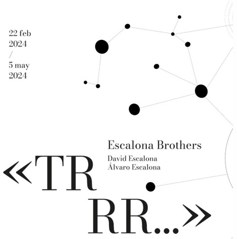
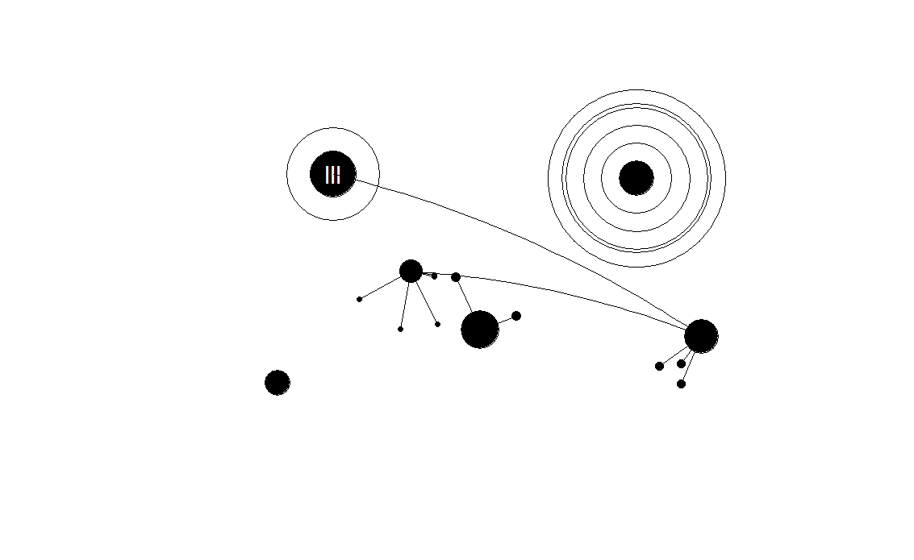

```{r setup, include=FALSE}
knitr::opts_chunk$set(echo = TRUE,fig.height=4,warning = FALSE,message = FALSE)
```


## trrr..

Qué mejor que retomar el blog con un gran arranque onomatopéyico "trrr.." es el sonido de un temblor, de un rugido de moto, un arranque brutal... eso es lo que os propongo en este regreso tras una larga ausencia, empecemos!.


Este juego músico-visual se me ocurrió en Granada hace unos días. Resulta que estaba paseando por esa bella ciudad y pasamos al patio del palacio de la Madraza, donde había una exposición de los (*Escalona Brothers*)[https://lamadraza.ugr.es/evento/trrrr-escalona-brothers/].

En medio del bullicio nocturno de la ciudad, me encontré de repente en un precioso patio de esos con encanto *granaino*. En la sala de exposiciones contigua encontré tirado en el suelo un pobre piano maltrecho, destrozado, con su arpa sangrante y una invasión de extraños temblores sónicos.

Me llamó poderosamente la atención unos dibujos muy simples de círculos y líneas en blanco y negro repartidos por la sala de exposiciones. Me quedé con uno de los folletos de la exposición en los que pude leer, ya a la mañana siguiente, que se trataba de representaciones de "*partituras gráficas, compuestas por símbolos inspirados en mapas de enjambres sísmicos*".



No negaré que la elegante descripción de sus creadores me dejó tocado 😂, y fue en ese momento cuando pensé en hacer mi particular versión de estas *"partituras gráficas"*, usando, claro está, R.





Las imágenes de los hermanos Escalona muestran una composición gráfica abstracta en blanco y negro. En ellas hay una serie de círculos negros concéntricos de diferentes tamaños y estilos que parecen estar conectados por finas líneas, creando una estructura que podría asemejarse a una red o un diagrama de conexiones. 

# De la idea al programa

El programa que voy a mostraros es el último de una serie de pruebas que paso a paso han ido conformándose hasta crear las funciones y flujo final, aunque básicamente mantienen la primera idea original que os cuento.

Realmente la primerísima idea para hacer estos dibujos en R, fue usar un paquete como *igraph*, del que ya hice un post hace tiempo [Igraph](http://enrdados.net/post/graficos-de-red-con-igraph/) u otros como `visNetwork` que aunque no lo he usado parece muy interesante ya que se pueden crear gráficos de red interactivos parecidos a los que buscamos.


El problema que tuve con estos paquetes es que no supe solucionar cómo crear los estilos propios para los círculos, así que cambié de estrategia tendría que progrtamar todo desde cero.

Muchos de mis post, más que de programación, son de diseño gráfico con R, es una debilidad que tengo, y eso que R no parece un programa bueno para esto, pero al final le sacamos partido, mira sino estos post de hace tiempo:

  * [Ciudad con R](../pintar-un-edificio-con-r)
  * [Dibujar un bosque con R](../hacer-un-bosque-con-r)
  * [Árboles fractales](../2021-09-23-arboles-con-funciones-recursivas)
  * [Waldeinsamkeit](../waldeinsamkeit)
  * [Dibujar ojos con R](../ojos)

## Descripción del programa

Para empezar me imaginé un lienzo sobre el que pintar aleatoriamente unos puntos. La función `initialize_canvas()` crea este lienzo blanco con el ancho y alto que le pasemos de parámetros.

Después la función `generate_circus()` crea una tabla con los puntos que serán el centro de los círculos así como algunas características de estos como el radio y estilo. Los círculos se pintarán con unos estilos diferentes sacados de las partituras gráficas de los *Escalona Brothers*, para crear estos estilos haré una función distinta llamada `draw_circles(circles)`.

Luego de crear los puntos y el correspondiente círculo hay que hacer la jerarquía de red , los enlaces entre círculos. Este apartado me ha llevado más pruebas que el resto. se trata de crear los enlaces mediante una estructura jerárquica familiar, donde algunos círculos actúan como "padres" de otros. Para esto he creado la función `assign_family_structure_ii()` que aunque empezó siendo muy simple, pues la primera prueba era puramente aleatoria, no quedaba bien y he tenido que meter más reglas como dar preferencia a los grandes radios como padres, y la cercanía a estos como hijos, así como cierta limitación de distancia. 

Para unir los padres con los hijos usé primero una simple línea, pero no quedaban bien, así que los cambié por *splines*, pero apenas había diferencia ya que solo usaba los dos puntos de los centros como definición del *spline*. La funcion final llamada `draw_splinessss(circles)` es algo más compleja pues añade un punto intermedio a la recta entre 2 círculos y lo desplaza para que el spline final tenga cierta curvatura.

Finalmente en la función `pinta_cuadro_circulos()` junta todo el proceso en una.

## Funciones del Programa

1. **`initialize_canvas(width, height)`**:
   - **Descripción**: Establece el área de dibujo (lienzo) en R, dibuja un rectángulo que delimita este lienzo y añade una firma con la fecha actual.
   - **Parámetros**:
     - `width`: Ancho del lienzo.
     - `height`: Alto del lienzo.
     
```{r}
## Programa generador de partituras gráficas
## Autor: Fernando Villalba
## Fecha: abril 2014
###########################################
  set.seed(123) # semilla aleatoria
# Paso 1: Función para establecer el lienzo
initialize_canvas <- function(width, height) {
  # incializa el gráfico en blanco
  plot(NULL, xlim=c(0, width), ylim=c(0, height), type="n", asp=1,axes = FALSE, xlab = "", ylab = "", main = "")
  # pinta un rectangulo de los bordes de ancho 
  rect(0, 0, width, height,lwd=5)
  # Obtener la fecha actual en formato deseado
  fecha_actual <- format(Sys.Date(), "%d %B %Y")
  # Añadir firma y fecha en la esquina inferior derecha
  # Usar bquote para insertar la variable evaluada en la expresión
  firma_fecha <- bquote(italic("VilBer") ~ "-" ~ .(fecha_actual))
 # text(x=95, y=5, labels=firma_fecha, adj=1, cex=0.8, font=3)
  mtext(side=1, line=-1, adj=1, text=firma_fecha, cex=0.8, font=2)
}
```

2. **`generate_circus(num_circles, width, height, min_radius, max_radius, nrad)`**:
   - **Descripción**: Genera un conjunto de círculos con posiciones y radios aleatorios dentro de los límites del lienzo, asegurándose de que los círculos no se superpongan más de una distancia mínima especificada.
   - **Parámetros**:
     - `num_circles`: Número de círculos a generar.
     - `width`, `height`: Dimensiones del lienzo.
     - `min_radius`, `max_radius`: Rango de radios para los círculos.
     - `nrad`: Factor que define la separación mínima entre círculos en función de su radio.
     
```{r}
# Paso 2: Función para crear la tabla con los datos de los circulos
generate_circus <- function(num_circles, width, height, min_radius, max_radius, nrad) {
  # num_circles = numero de circulos en el lienzo
  # width, height = ancho y alto del lienzo 
  # min_radius, max_radius = min y max valor del radio de los circulos generados
  # nrad = indica la distancia de separación minima de los circulos, para que no se superpongan en numero de veces el radio maximo
  circles <- data.frame(id = integer(0), x = numeric(0), y = numeric(0), radius = numeric(0), estilo = integer(0),id_padre = integer(0))
  max_attempts <- 1000  # Límite de intentos para evitar bucles infinitos
  
  for (i in 1:num_circles) {
    valid <- FALSE
    attempts <- 0
    
    while (!valid && attempts < max_attempts) {
      # Genera un nuevo punto y radio
      new_x <- runif(1, min_radius, width - min_radius)
      new_y <- runif(1, min_radius, height - min_radius)
      new_radius <- runif(1, min_radius, max_radius)
      attempts <- attempts + 1
      
      # Verifica la distancia con todos los círculos ya creados
      if (nrow(circles) == 0) {
        valid <- TRUE
      } else {
        distances <- sqrt((circles$x - new_x)^2 + (circles$y - new_y)^2)
        min_distance_needed <- nrad * max(max_radius, new_radius)  # nrad veces el radio máximo de cualquiera
        valid <- all(distances >= min_distance_needed)
      }
    }
    
    if (valid) {
      style <- sample(1:5, 1)
      circles <- rbind(circles, data.frame(id = i, x = new_x, y = new_y, radius = new_radius, estilo=style, id_padre = 0))
    } else {
      stop("No fue posible colocar todos los círculos tras ", max_attempts, " intentos.")
    }
  }
  
  # Asignación de ID del padre (opcional y personalizable)
circles$id_padre <- sapply(circles$id, function(x) {
  if (runif(1) < 0.7) {
    # 70% de probabilidad de que el círculo no tenga padre
    return(0)
  } else {
    # Los círculos con radios mayores tienen más posibilidad de ser elegidos como padres
    # Calculamos pesos, donde el peso es proporcional al radio
    weights <- circles$radius / min(circles$radius)  # Esto asegura que el círculo más pequeño tenga peso 1
    weights <- weights * ifelse(circles$radius >= median(circles$radius), 3, 1)  # Doble de peso si el radio es mayor o igual que la mediana
    
    # Asegurarse de no incluir el propio círculo como su padre
    weights[x] <- 0
    
    # Selecciona un id de padre de acuerdo con los pesos
    return(sample(circles$id, 1, prob = weights))
  }
})

  return(circles)
}
```

3. **`assign_family_structure_ii(circles, width, height)`**:
   - **Descripción**: Asigna una estructura jerárquica de relaciones padre-hijo a los círculos basada en su proximidad y tamaño. Los círculos solo pueden ser padres de otros círculos si están dentro de una distancia menor a cuarto de la diagonal del lienzo.
   - **Parámetros**:
     - `circles`: DataFrame de círculos generados.
     - `width`, `height`: Dimensiones del lienzo.

```{r}
# Paso 3: Función que crea la relación entre padre-hijo de los circulos
# asigna la estructura de padre hijo
assign_family_structure_ii <- function(circles, width, height) {
  # Calcular 1/4 de la diagonal del lienzo
  max_distance <- 0.25 * sqrt(width^2 + height^2)

  # Ordenar círculos por radio de mayor a menor y resetear índices
  circles <- circles[order(-circles$radius), ]
  circles$id <- seq_len(nrow(circles))  # Asignar un ID consecutivo a cada círculo
  circles$id_padre <- 0  # Inicializar todos los id_padre a 0

  # Iterar sobre cada círculo para asignar hijos
  for (i in 1:nrow(circles)) {
    if (circles$id_padre[i] == 0) {  # Solo si el círculo no tiene aún un padre asignado
      # Determinar cuántos hijos asignar
      num_cercanos <- sample(0:(nrow(circles)/4), 1)

      if (num_cercanos > 0) {
        # Calcular distancias desde el círculo actual a todos los demás
        distances <- sqrt((circles$x - circles$x[i])^2 + (circles$y - circles$y[i])^2)
        distances[i] <- Inf  # Evitar que un círculo sea su propio hijo

        # Filtrar por distancia máxima permitida
        within_distance <- distances < max_distance

        # Ordenar por distancia y seleccionar los 'num_cercanos' más cercanos que no tengan padre asignado y estén dentro del límite de distancia
        closest_indices <- order(distances)
        child_candidates <- closest_indices[circles$id_padre[closest_indices] == 0 & within_distance[closest_indices]][1:num_cercanos]

        # Asignar el id actual como padre a los círculos más cercanos sin padre asignado y dentro del límite de distancia
        circles$id_padre[child_candidates] <- circles$id[i]
      }
    }
  }

  return(circles)
}
```

4. **`draw_splinessss(circles)`**:
   - **Descripción**: Dibuja líneas curvas (splines) entre círculos padres e hijos para visualizar las relaciones familiares.
   - **Parámetros**:
     - `circles`: DataFrame de círculos con estructura familiar asignada.

```{r}
# Paso 4: Funciones de dibujo 
# dibuja splines entre los centros de los circulos padre e hijos
draw_splinessss <- function(circles) {
  # Asegura que los splines se dibujan sobre los círculos existentes
  par(new = TRUE)

  for (i in 1:nrow(circles)) {
    if (circles$id_padre[i] != 0) {
      # Encuentra el círculo padre
      padre <- circles[circles$id == circles$id_padre[i], ]
      if (nrow(padre) == 1) {  # Asegúrate de que el padre existe
        # Define los puntos inicial y final para el spline
        x1 <- circles$x[i]
        y1 <- circles$y[i]
        x2 <- padre$x
        y2 <- padre$y
        radio_menor <- max(circles$radius[i], padre$radius)

        # Calcula el punto medio
        xm <- (x1 + x2) / 2
        ym <- (y1 + y2) / 2

        # Desplazamiento perpendicular a la línea entre los puntos
        # Calcula un vector perpendicular
        dx <- x2 - x1
        dy <- y2 - y1
        # Normaliza y rota 90 grados
        len <- sqrt(dx^2 + dy^2)
        dx_perp <- -dy / len
        dy_perp <- dx / len
        # Calcula el punto de desviación
        xm_desplazado <- xm + radio_menor * dx_perp
        ym_desplazado <- ym + radio_menor * dy_perp

        # Puntos para xspline incluyen el punto desviado
        x_points <- c(x1, xm_desplazado, x2)
        y_points <- c(y1, ym_desplazado, y2)
        
        # Dibuja un spline entre el hijo y el padre con curvatura
        xspline(x = x_points, y = y_points, shape = sample(c(-1,1), 1), border = "black", lwd = 1)
      }
    }
  }
}
```

5. **`draw_circles(circles)`**:
   - **Descripción**: Visualiza los círculos en el lienzo, aplicando estilos variados que incluyen círculos rellenos, círculos con bordes, y círculos con decoraciones adicionales como mini planetas.
   - **Parámetros**:
     - `circles`: DataFrame de círculos con estilos y posiciones definidas.
     
```{r}

# Funcion que pinta los circulos según el estilo 
draw_circles <- function(circles) {
  apply(circles, 1, function(circle) {
    # Asigna un estilo de forma aleatoria para demostración; ajusta según la lógica deseada
    style <- circle["estilo"]# sample(1:5, 1)

    if (style == 1) {
      # Dibujar círculo negro con relleno negro
      symbols(circle["x"], circle["y"], circles=circle["radius"], inches=FALSE, add=TRUE, fg="black", bg="black")
    } else if (style == 2) {
      # Dibujar círculo con borde negro y relleno blanco
      symbols(circle["x"], circle["y"], circles=circle["radius"], inches=FALSE, add=TRUE, fg="black", bg="white")
    } else if (style == 3) {
      # Dibujar círculos concéntricos
      for (i in 2:5) {
        symbols(circle["x"], circle["y"], circles = circle["radius"] * i, inches = FALSE, add = TRUE)
      }
      symbols(circle["x"], circle["y"], circles = circle["radius"] * 4+0.2*circle["radius"], inches = FALSE, add = TRUE)
      symbols(circle["x"], circle["y"], circles = circle["radius"], inches = FALSE, add = TRUE, fg = "black",bg = "black")
    } else if (style == 4) {
      # Dibujar dos círculos concéntricos y una letra encima
      symbols(circle["x"], circle["y"], circles=circle["radius"] * 2, inches=FALSE, add=TRUE, fg="black", bg="white")
      symbols(circle["x"], circle["y"], circles=circle["radius"], inches=FALSE, add=TRUE, fg="black", bg="black")
      angle <- runif(1, 0, 360)  # Genera un ángulo aleatorio entre 0 y 360 grados
      text(circle["x"], circle["y"], "lll", col="white", cex=1.5, srt=angle)
  #    text(circle["x"], circle["y"], "lll", col="white", cex=1.5)  # Puedes cambiar "R" por cualquier otra letra
    } else if (style == 5) {
      # Dibuja un circulo con mini planetas alrededor
      # 1. el circulo central
      symbols(circle["x"], circle["y"], circles=circle["radius"], inches=FALSE, add=TRUE, fg="black", bg="black")
      # 2. los planetas
        n_planet=sample(2:5, 1) # numero de planetas 
        for (i in 1:n_planet){
          rad_mini<- circle["radius"] / 4  # un cuarto del radio del planeta central
          r_orbit<- sample(2:5, 1) # dist orbital del planeta en num de radios del central
          ang_planet <- runif(1, min = 0, max = 2*pi) # angulo del planeta en radianes 
        # Calcular la posición de cada mini círculo
          x_mini <- circle["x"] + r_orbit * circle["radius"] * cos(ang_planet)
          y_mini <- circle["y"] + r_orbit * circle["radius"] * sin(ang_planet)
        # Dibujar los mini círculos y las líneas que los unen al círculo principal
        # Todos los mini círculos son negros macizos  
          symbols(x_mini, y_mini, circles=rad_mini, inches=FALSE, add=TRUE, fg="black", bg="black") 
        # Dibuja la linea que lo une al planet central     
          lines(c(circle["x"],x_mini ), c(circle["y"], y_mini), col = "black")     
        }
      }
  })# fin de funcion appply
}
```

6. **`pinta_cuadro_circulos(width, height, radio_min, radio_max, rad_cercania, num_circles)`**:
   - **Descripción**: Función principal que orquesta la creación del lienzo, la generación de círculos, la asignación de la estructura familiar y la visualización final de los círculos y sus conexiones.
   - **Parámetros**:
     - `width`, `height`: Dimensiones del lienzo.
     - `radio_min`, `radio_max`: Rango de radios para los círculos.
     - `rad_cercania`: Factor de cercanía para evitar superposición de círculos.
     - `num_circles`: Número de círculos a generar.

```{r}
# Función que recoge todo lo anterior para pintar un cuadro
pinta_cuadro_circulos<-function(width=1000,height=800,radio_min=5,radio_max=50,rad_cercania=1,num_circles=10){
    #num_circles <- sample(3:20, 1)  # Número aleatorio de círculos entre 5 y 20
    par(mar=c(0.1, 0.1, 0.1, 0.1))
    initialize_canvas(width, height)
    clip(0, width, 0, height) # recorta el dibujo por el corte con los ejes
    circles <- generate_circus(num_circles, width, height, radio_min, radio_max, rad_cercania)
    circles1 <-assign_family_structure_ii(circles, width, height)
    draw_splinessss(circles1)
    draw_circles(circles1)
}
```

# Uso

Con cada llamada a la función `pinta_cuadro_circulos()`, se genera un nuevo lienzo de partitura gráfica, espero que os guste.


Otro ejemplo:

```{r warning = FALSE, message = FALSE}

pinta_cuadro_circulos(radio_min=2,radio_max=45,rad_cercania=3,num_circles=20)

```