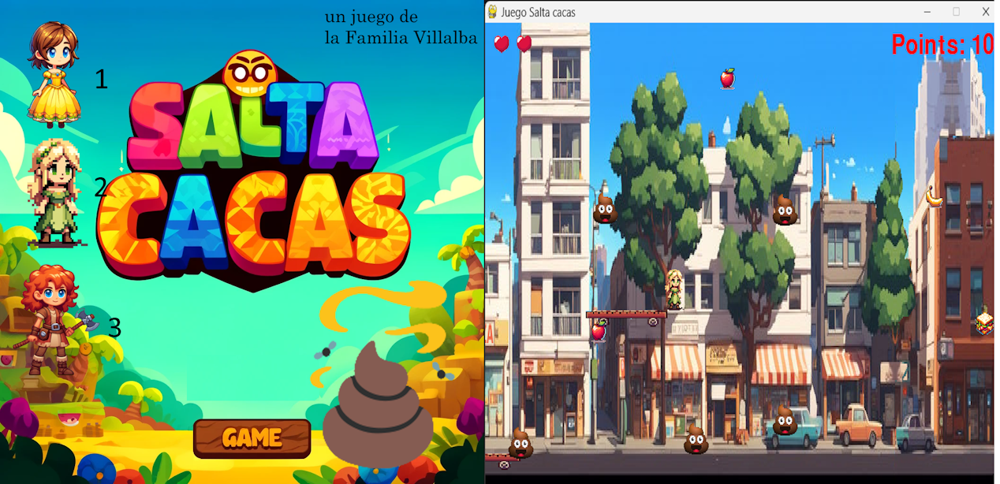
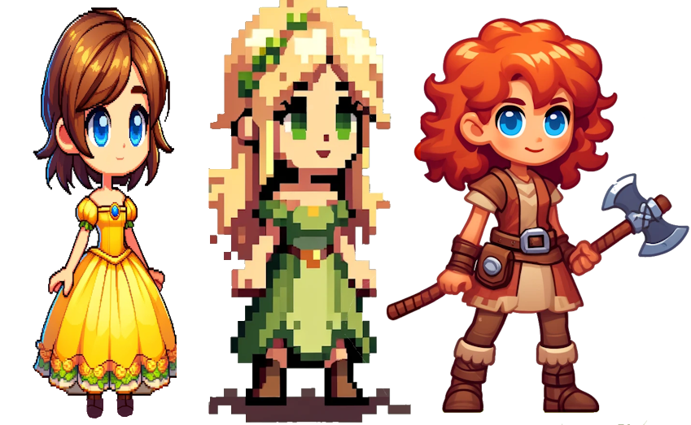

## Creando nuestro primer Juego



### Introducción
Hace unos días, en nuestro camino mañanero al colegio se nos ocurrió la idea de hacer un videojuego. Lo cierto es que cada día miesntras vamos con prisas paseando hasta el cole, nos toca saltar unos cuantos obstáculos un tanto asquerosos 💩, si hablamos de las cacas de perrito, que los dueños creen que mejoran el entorno urbano dejándolas en las aceras como una obra de arte en medio de la sala de un museo.


Hace unos días, la cosa fue realmente de record, pues contamos unos 5 💩, entre casa y el cole, en unas aceras estrechas de pueblo, así que tienes que ir super atento para no llegar con tan insigne regalo pegado en los zapatos o aún peor, engrasando las ruedas de las mochilas 😂.

Esa fue nuestra inspiración para el juego, así que esa misma tarde nos pusimos manos a la obra.

### Concepto del Juego
Nuestra idea era crear un juego de plataformas estilo "Mario Bros",con nieveles variados, enemigos y obstáculos, y un sistema de puntuación, pero en nuestra versión, los obstáculos y enemigos eran las 💩 cacas en las aceras, y el fondo será nuestro paseo de casa al cole.

Lo malo es que no tengo ni idea de cómo se hace un vídeo juego de estos, así que me puse a investigar un poco y básicamente lo que vi es que actualmente casi todos los juegos se hacen con motores como:

 * Unity (C#): Bueno para 2D y 3D.
 * Unreal Engine (C++/Blueprints): Excelente para 3D.
 * Godot (GDScript/C#/C++): Ideal para 2D y 3D y de **código libre**.
 * Pygame (Python): Bueno para 2D.
 
En R vi algunas cosas para juegos: está *shiny* con el que se puede hacer de todo, está Rcada (`> devtools::installl_github('RLesur/Rcada')`) para jugar arcade desde R y luego hay algunos programadores que han hecho sus [juegos](https://lucidmanager.org/data-science/text-adventure/) pero bastante "poco visuales. En definitiva R no es lenguaje para esto, donde los lenguajes multipropósito como Java y Python son mucho más apropiados.

Con mi hija pequeña, habíamos visto algún video de youtube de Godot, que es un entorno libre para la creación de videojuegos que parece bastante bueno, pero aún así, para el primerísimo que hacemos me parecía mucho lío, y como ya llevo un añito probando cosas de python me decidí por usar este fascinante y simple lenguje para crear el juego, y - esto es un spoiler- creo que acertamos pues me ha parecido sencillísimo y el resultado genial para el tiempo dedicado.

### Herramientas Utilizadas
Una vez decididos por Python descubrimos que la librería *Pygame* es específica para crear juegos 2D como el que queríamos.
Así que manos a la obra, para python me he acostumbrado a usar VSCode en lugar de Rstudio, ya sabes manías de cada uno, aunque para python es suficiente con crear una carpeta limpia y un archivo de texto simple que para reconocer que es código lo acabamos en` *.py` 

### Desarrollo Programación
#### Configuración Inicial
Comenzamos por instalar Pygame:

```python
pip install pygame
```
Para instalar librerías en python se usa el comando `pip install nombrelibrería`

#### Estructura del Proyecto
La verdad es que empecé escribiendo todo en un solo fichero de texto, pero a medida que iba incorporando cosas vi que sería mejor  crear una estructura de programa, así repartiría en diferentes ficheros código específico de funciones en uno, de clases e otro y de las pantallas de juego en otro.

de todas formas no me hagasi mucho caso, este es el primer programa en python que hago completo, pues hasta hoy solo ejecutaba pequeños scripts para probar cosillas.

El caso es que la estructura del programa final que os presento es esta:

```
my_game/
├── main.py
├── settings.py
├── functions.py
├── classes.py
├── screens.py
├── assets/
│   ├── background.png
│   ├── background_music.mp3
│   ├── game_over.png
│   ├── player1.png
│   ├── player2.png
│   ├── player3.png
│   ├── platform.png
│   ├── heart.png
│   ├── tomato.png
│   ├── apple.png
│   ├── banana.png
│   ├── grape.png
│   └── ...
├── high_scores.csv
```

Consta de 5 fichero `*-py`, y una carpeta llamada `assets/` en la que vamos poniendo todas las imágenes, sonidos etc. del juego.

Lo que es genial es que con `Pygame` es muy fácil importar imágenes, así que por ejemplo crear los personajes personalizados es tan fácil como guardar en esta carpeta una imagen llamada *player1.png* que es la que importa el juego para el jugador 1.

Mis hijas se han metido en DALL-E y han puesto un *promt* que refleje cómo querían ser en el juego, así que cada una tiene su personaje, así de simple:


>DALL·E --> Create a simple 2D pixel art style image of a female character with blonde hair, wearing a green dress and a diadem. .....


#### Código Principal (main.py)
El archivo `main.py` contiene el código principal. Aquí es donde inicializamos *Pygame*, cargamos los recursos y manejamos el bucle principal del juego, pues al fin y al cabo, un juego es un bucle o loop que se repite sin cesar hasta el fin del juego.

En este script, cargamos primero las imagenes y sonidos de fondo y enseguida llama a la primera pantalla, la de inicio que es la función `show_start_screen()` que está en el fichero *screens.py*

```python
# main.py

import pygame
import sys
from settings import *
from functions import check_create_csv, save_score
from classes import Player, Platform, Enemy, Fruit
import screens

# Inicialización de Pygame
pygame.init()

# Cargar Música de Fondo
pygame.mixer.music.load('assets/background_music.mp3')
pygame.mixer.music.set_volume(0.5)
pygame.mixer.music.play(-1)

# Configuración de la pantalla
screen = pygame.display.set_mode((SCREEN_WIDTH, SCREEN_HEIGHT))
pygame.display.set_caption("Juego de Plataformas")

# Cargar Imágenes
background = pygame.image.load('assets/background.png')
background = pygame.transform.scale(background, (SCREEN_WIDTH, SCREEN_HEIGHT))
background_phase2 = pygame.image.load('assets/background_phase2.png')
background_phase2 = pygame.transform.scale(background_phase2, (SCREEN_WIDTH, SCREEN_HEIGHT))
heart_image = pygame.image.load('assets/heart.png')
heart_image = pygame.transform.scale(heart_image, (30, 30))
game_over_image = pygame.image.load('assets/game_over.png')
game_over_image = pygame.transform.scale(game_over_image, (SCREEN_WIDTH, SCREEN_HEIGHT))
start_screen = pygame.image.load('assets/start_screen.png')
start_screen = pygame.transform.scale(start_screen, (SCREEN_WIDTH, SCREEN_HEIGHT))
player1_image = pygame.image.load('assets/player1.png').convert_alpha()
player1_image = pygame.transform.scale(player1_image, (50, 50))
player2_image = pygame.image.load('assets/player2.png').convert_alpha()
player2_image = pygame.transform.scale(player2_image, (50, 50))
player3_image = pygame.image.load('assets/player3.png').convert_alpha()
player3_image = pygame.transform.scale(player3_image, (50, 50))

# Asegurar la creación del archivo CSV
check_create_csv()

# Seleccionar jugador
player_image, player_name = screens.show_start_screen(screen, start_screen, player1_image, player2_image, player3_image)

# Crear jugador
player = Player(player_image, pygame.image.load('assets/player_collision.png').convert_alpha())

# Crear grupos de sprites
all_sprites = pygame.sprite.Group()
platforms = pygame.sprite.Group()
enemies = pygame.sprite.Group()
fruits = pygame.sprite.Group()

all_sprites.add(player)

# Crear plataformas
platform1 = Platform(100, 500)
platform2 = Platform(400, 400)
platform3 = Platform(250, 300)
platforms.add(platform1, platform2, platform3)
all_sprites.add(platform1, platform2, platform3)

# Función para crear enemigos
def create_enemy():
    x = SCREEN_WIDTH
    y = random.randint(0, SCREEN_HEIGHT - 50)
    enemy = Enemy(x, y)
    enemies.add(enemy)
    all_sprites.add(enemy)

# Crear enemigos al inicio del juego
num_enemies = random.randint(2, 5)
for _ in range(num_enemies):
    create_enemy()

# Función para crear frutas
def create_fruit():
    x = SCREEN_WIDTH
    y = random.randint(0, SCREEN_HEIGHT - 30)
    fruit_type = random.choice(['apple', 'banana', 'grape', 'tomato'])
    speed_x = random.randint(-3, -1)
    fruit = Fruit(x, y, fruit_type, speed_x)
    fruits.add(fruit)
    all_sprites.add(fruit)

create_fruit()
create_fruit()

# Función para dibujar vidas
def draw_lives(surface, x, y, lives, image):
    for i in range(lives):
        img_rect = image.get_rect()
        img_rect.x = x + 35 * i
        img_rect.y = y
        surface.blit(image, img_rect)

# Función para dibujar puntos
def draw_points(surface, points, x, y):
    font = pygame.font.Font(None, 48)
    text = font.render(f'Points: {points}', True, WHITE)
    text_rect = text.get_rect()
    text_rect.topright = (x, y)
    surface.blit(text, text_rect)

# Inicializar temporizador de frutas
fruit_timer = 0
fruit_interval = 100

# Variables de nivel
current_level = 1
FPS = 60 # velocidad del juego

# Bucle principal del juego
running = True
while running:
    for event in pygame.event.get():
        if event.type == pygame.QUIT:
            running = False
        elif event.type == pygame.KEYDOWN:
            if event.key == pygame.K_SPACE:
                player.jump()
            if event.key == pygame.K_LEFT:
                player.move_left()
            if event.key == pygame.K_RIGHT:
                player.move_right()
        elif event.type == pygame.KEYUP:
            if event.key in (pygame.K_LEFT, pygame.K_RIGHT):
                player.stop()
        elif event.type == pygame.USEREVENT:
            player.image = player_image
            pygame.time.set_timer(pygame.USEREVENT, 0)

    all_sprites.update()

    fruit_timer += 1
    if fruit_timer >= fruit_interval:
        create_fruit()
        fruit_timer = 0

    hits = pygame.sprite.spritecollide(player, platforms, False)
    if hits:
        player.rect.y = hits[0].rect.top - player.rect.height
        player.speed_y = 0

    enemy_hits = pygame.sprite.spritecollide(player, enemies, False)
    if enemy_hits and not player.invulnerable:
        player.lives -= 1
        print(f"Lives left: {player.lives}")
        player.image = player.collision_image
        player.become_invulnerable(120)
        pygame.time.set_timer(pygame.USEREVENT, 500)
        if player.lives == 0:
            print("Game Over")
            save_score(player_name, player.points, screen)
            screen.blit(game_over_image, (0, 0))
            pygame.display.flip()
            pygame.time.wait(3000)
            running = False

    fruit_hits = pygame.sprite.spritecollide(player, fruits, True)
    for fruit in fruit_hits:
        player.points += fruit.value
        print(f"Points: {player.points}")

    if player.points >= 100 and current_level == 1:
        screens.show_level_transition(screen, "LEVEL 2")
        current_level = 2
        FPS = 90  # Aumentar la velocidad general
        background = background_phase2

    screen.blit(background, (0, 0))
    all_sprites.draw(screen)
    draw_lives(screen, 10, 10, player.lives, heart_image)
    draw_points(screen, player.points, SCREEN_WIDTH - 10, 10)
    pygame.display.flip()
    clock.tick(FPS)

pygame.quit()
sys.exit()
```

#### Manejo de Pantallas (screens.py)
El archivo `screens.py` contiene funciones para manejar diferentes pantallas del juego, como la pantalla de inicio y las transiciones entre niveles.

```python
# screens.py

import pygame
from functions import read_high_score

def show_start_screen(screen, start_screen, player1_image, player2_image, player3_image):
    high_score_player, high_score = read_high_score()
    screen.blit(start_screen, (0, 0))
    font = pygame.font.Font(None, 36)
    text = font.render('Press 1 for Player 1, 2 for Player 2, or 3 for Player 3', True, (255, 

255, 255))
    screen.blit(text, (400 - text.get_width() // 2, 300))
    
    if high_score_player:
        high_score_text = font.render(f'High Score: {high_score} by {high_score_player}', True, (255, 255, 255))
    else:
        high_score_text = font.render(f'High Score: {high_score}', True, (255, 255, 255))
    
    screen.blit(high_score_text, (400 - high_score_text.get_width() // 2, 350))
    pygame.display.flip()
    selecting = True
    while selecting:
        for event in pygame.event.get():
            if event.type == pygame.QUIT:
                pygame.quit()
                sys.exit()
            elif event.type == pygame.KEYDOWN:
                if event.key == pygame.K_1:
                    return player1_image, "Player 1"
                elif event.key == pygame.K_2:
                    return player2_image, "Player 2"
                elif event.key == pygame.K_3:
                    return player3_image, "Player 3"

def show_level_transition(screen, level_text):
    screen.fill((0, 0, 0))  # Fondo negro
    font = pygame.font.Font(None, 74)
    text = font.render(level_text, True, (255, 255, 255))
    screen.blit(text, (SCREEN_WIDTH // 2 - text.get_width() // 2, SCREEN_HEIGHT // 2 - text.get_height() // 2))
    pygame.display.flip()
    pygame.time.wait(3000)  # Esperar 3 segundos
```

Si vas a probar el juego por ti mismo te recomiendo que uses mi ultima versión en github, y no el código que pongo aquí, pues seguramente iré poniendo mejoras y cosas nuevas allí.

Puedes copiarlo entero desde [aquí](https://github.com/fervilber/saltacacas):


### Creación del Ejecutable

Para distribuir el juego, usamos la librería *PyInstaller* que crea un fichero ejecutable (*.exe). aquí lo único a tener en cuenta es que para qué funcione el juego hay dos maneras, o repartir el ejecutable junto con la carpeta assets donde están las imágenes (e incluso lo bueno de esto es que las puedes cambiar y crear tu propio avatar para jugar) o, la forma más completa, que sería que el ejecutable contenga ya todos los ficheros que necesita dentro del mismo.

Para esto hay que crear una función nueva y sustituirla en todo el código donde se cargen imágenes o sonidos o cualquier cosa del directorio `assets`.

```python
# función importante de cara a hacer después el ejecutable y mantenerlas rutas relativas
def resource_path(relative_path):
    """ Get absolute path to resource, works for dev and for PyInstaller """
    base_path = getattr(sys, '_MEIPASS', os.path.dirname(os.path.abspath(__file__)))
    return os.path.join(base_path, relative_path)

```
una vez cambiado esto en el código podemos generar el `*.exe` con este simple código desde el terminal de *VS Code*:

>pyinstaller --name my_game --onefile --add-data "assets:assets" main.py 

que lo que hace es incluir en el fichero todos los documentos externos del directorio `assets`, con lo que simplemente con grabar el fichero que se crea en la carpeta` dist/` y que en mi caso es *saltacacas.exe* en un USB se lo puedo dar a cualquiera con windows y jugar!!!.


### Conclusión

Crear este juego ha sido una experiencia increíble. Mis hijas han disfrutado muchísimo y les ha encantado ver sus avatares como personajes de este juego creado por ellas mismas. Para descargar la ultma versión te recomiendo que vayas a este enlace de gitHub:
o con git desde VS Code copiando esto:

[https://github.com/fervilber/saltacacas](https://github.com/fervilber/saltacacas)

Hemos aprendido mucho sobre desarrollo de juegos y *Pygame* nos ha parecido una librería sencilla, fácil y con resultados excelentes para manejo de gráficos, sonidos, y distribución de software.

A Sofía le ha gustado tanto que quiere ser programadora de videojuegos!!!,así que os animo a divertiros un rato con los niños y que en lugar de pagar 50 € por un juego de la nintendo, hagais vosotros mismos con ellos algo parecido a nuestro SALTACACAS😂.

Si tienes alguna pregunta o comentario, no dudes en dejarnos un comentario. ¡Gracias  amigos!
