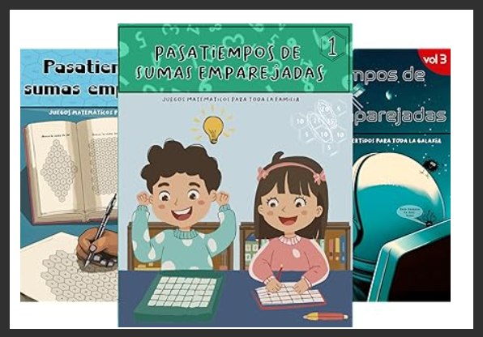
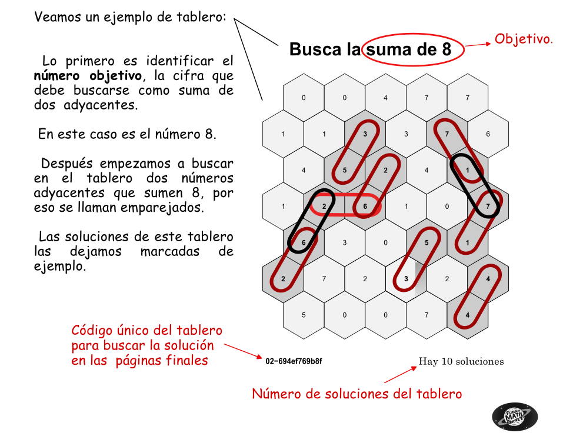
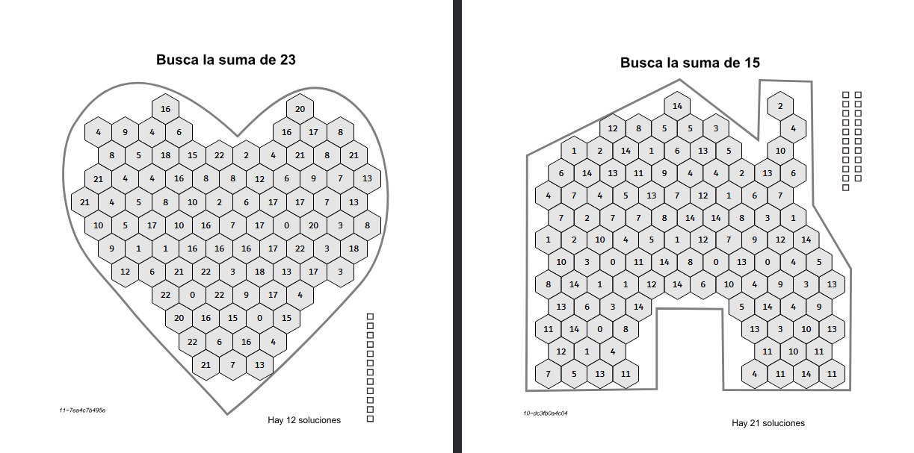
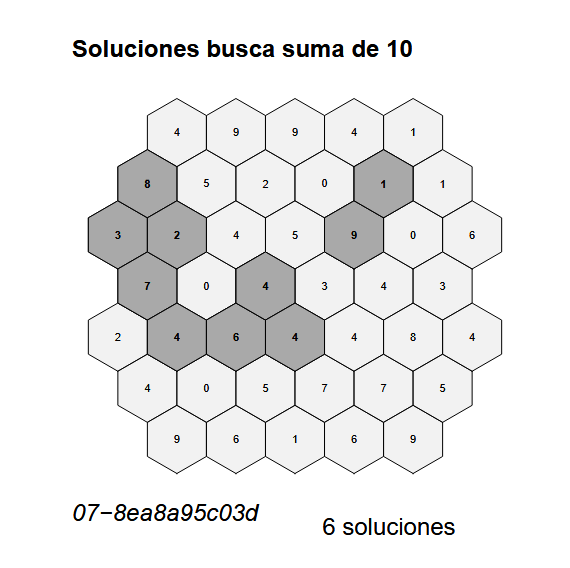
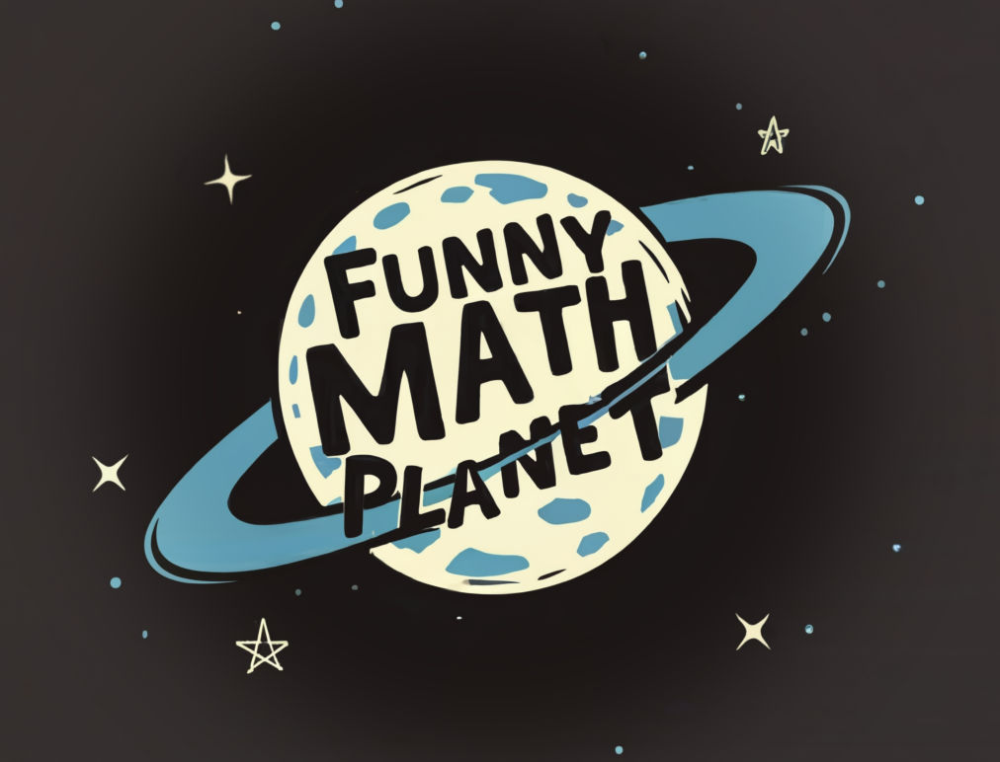

¡Saludos, enRdados!

Hoy os traigo una de esas ideas que mezclan mis pasiones: **R**, el diseño gráfico, la educación y el emprendimiento. Ya sabéis que me encanta esto del **diseño generativo con R**, que es básicamente usar funciones y algo de aleatoriedad para crear hermosos *objetos visuales*. También me gusta que los capítulos del Blog tengan su parte didáctica y educativa, pero la guinda de este proyecto es que le añadimos (junto a mis peques) ese punto de empresa para que descubrieran uno de los pilares fundamentales de la innovación, que es *emprender*.

Os voy a contar cómo surgió todo, pero para los impacientes aquí dejo el <a href="https://www.amazon.es/dp/B0D56YKC7J?binding=paperback&ref=dbs_dp_sirpi " target="_blank" rel="noopener noreferrer"> enlace directo de venta en amazon de estos pasatiempos que vamos a crear hoy!!! </a>



Creo que fue en el verano de 2023, cuando vi un curioso <a href="https://youtu.be/PKIpNtFCMzA?si=roL9L8PrABgRJVx9" target="_blank" rel="noopener noreferrer">video en youtube de un gallego</a> que decía dedicarse a vender libros de colorear  por amazon y que ganaba bastante dinero con eso.

La idea de crear libros de colorear parecía tan simple, y tan buena que ciertamente me creí que eso podía funcionar de verdad. Todavía no se había cumplido un año desde el lanzamiento de cHatGPT y aunque había modelos que generaban imágenes con IA, los resultados eran más bien malos. Stable Diffusion nació en agosto del 22, así que para noviembre ya se podían encontrar modelos de generación de imagen interesantes, pero la idea de copiar esto sin innovar no me atrajo.

Los que seguís este Blog puede que recordéis que hace muchoooo tiempo dediqué un post a <a href="https://enrdados.netlify.app/post/2021-01-07-editar-un-libro-con-r/ " target="_blank" rel="noopener noreferrer"> cómo hacer un libro con R </a>. Para obtener un ejemplar impreso del mismo use bubok una imprenta online que en el 2021 funcionaba bien. Con el tiempo aprendí a editar libros en *Amazon* ya que la calidad que daba es mejor y a menor precio.


```{r, eval=TRUE}
blogdown::shortcode("youtube", "PKIpNtFCMzA")
```


## Amazon KDP

Amazon tiene una división de autoedición editorial que se llama *amazon KDP*. Básicamente han montado una editorial en línea en la que si subes tu pdf y una portada puedes publicar un libro en unos cuantos click. La cosa no es tan sencilla como parece, al menos para mi primer libro  en KDP tardé lo suyo, pero una vez que le pillas el tranquillo es mecánico y "*sencillo*".

Es por esto que el video del Gallego me pareció una forma realmente simple de vender un producto, pero el producto de libros para colorear no me gustaba, así que me puse a investigar otro *nicho de mercado*, y descubrí los pasatiempos.

## Libros de pasatiempos
Cuantos libros de pasatiempos se venden?... miles?, millones?, seguro que muchos, y muchos de ellos por amazon, pues aunque en España sea más barato y rápido acercarte al kiosco o al chino de la esquina, en otros lugares estoy seguro de que la gente le resulta más cómodo compra por internet desde el sofá de su casa.

Hacer libros de pasatiempos es fácil si los generas automáticamente y ahí es donde entra la pata de la programación en esta historia. El proyecto va tomando forma, y me puse manos a la obra.

Lo primero que pensé es en programar con R un generador de laberintos, me gustam mucho, y tengo varias pruebas hechas, pero hay cientos de programas para generar sopas de letras y laberintos que lo hacían mucho mejor que con mi código en R, y me estaba costando mucho mejorarlo. Había que pensar un pasatiempo nuevo...

Como había hecho un post de <a href="https://enrdados.netlify.app/post/2021-03-20-r-logos-con-hexsticker/" target="_blank" rel="noopener noreferrer">logos de R con hexsticker</a>, me vino la inspiración de crear una malla de hexágonos en el espacio en la que había que inventar algún juego matemático. Y así surgió la idea de estos pasatiempos de **"Sumas Emparejadas"**.

## ¿Qué son las "Sumas Emparejadas"?

La idea es simple: tengo un tablero, en este caso una **malla de hexágonos**, donde cada hexágono tiene un número dentro. El juego consiste en encontrar **pares de hexágonos que sean vecinos** (que se toquen) y cuyos números **sumen una cantidad determinada** que definimos al inicio de cada tablero de juego (el `valor_buscado`). Es un pasatiempo visual y numérico, ideal para echar un rato y de paso practicar las sumas y la atención.



## ¿Por qué hacerlo con R?

Podría diseñar los tableros a mano o con otro programa, claro, pero qué digo, si este es un Blog de R!, con R **puedes programar todo lo que se te ocurra** y automatizar el proceso para generar **tantos pasatiempos únicos como quieras**. Además, R es una máquina para **crear gráficos de calidad** y, como ya vimos con lo de [generar pdfs](), ¡es perfecto para dejar el pasatiempo listo para imprimir! y juntar muchos en un librito.

Así que, ni corto ni perezoso, ¡manos a la obra para programar esto!


## La Estructura del Código: Un Paseo por las Funciones

Aquí os pongo el resumen final de mi código, aunque durante la programación le dí muchas vueltas. Como siempre trato de dividir el trabajo en varias funciones y luego usar una para llamar a cada parte secuencialmente. Esa **función principal** se llama *(`new.game`)* que orquesta todo, llamando a las otras funciones que hacen tareas más específicas: una crear la malla hexagonal, otra pone los números en el centro de cada hexágono, otra busca las soluciones del tablero y finalmente otra imprime el pdf del juego en una página y en otra la solución.

Aquí os resumo las funciones básicas:

### 4.2.2 `crea.malla_new` y `crea.forma` (¡Creando el Tablero!)

- El primer paso es tener el tablero hexagonal. Para esto, he usado la maravillosa librería `sf` (simple features), que es la caña para trabajar con datos espaciales y geometrías (verl el post que hice explicando esta librería <a href="https://enrdados.netlify.app/post/manual-de-sf-para-sig/" target="_blank" rel="noopener noreferrer">aquí</a>). La función clave es **`st_make_grid()`**. Si le pones el argumento `square = FALSE`, ¡voilà!, te crea una malla de hexágonos en lugar de cuadrados.

```{r crear_malla_hex, echo=FALSE, warning=FALSE, message=FALSE}
# Cargamos la librería sf (¡fundamental para esto!)
library(sf)
library(dplyr)

# Definimos el área donde queremos la malla (un simple cuadrado)
area_juego <- st_polygon(list(cbind(c(0, 5, 5, 0, 0), c(0, 0, 5, 5, 0))))
area_juego <- st_sfc(area_juego) # Lo convertimos a objeto sf

# ¡Creamos la malla hexagonal!
# size define el tamaño aproximado de los hexágonos
malla_hex <- st_make_grid(area_juego, square = FALSE, cellsize = 1)

# Podemos echarle un vistazo rápido a la malla
plot(malla_hex)
```
Para el juego definitivo he añadido la posibilidad de darle **diferentes formas** al tablero (círculo, rombo, etc.). Esto lo hace la función `crea.forma`, que usa operaciones espaciales de `sf` como `st_buffer` (para crear áreas alrededor de puntos o geometrías), `st_within` (para ver qué hexágonos caen dentro de una forma), o `st_difference` y `st_union` (para cortar o juntar geometrías). ¡Es como usar un cortador de galletas, pero con código!

Aquí podéis ver diferentes resultados en la forma de los tableros usando la función `crea.forma`:



```{r funciones_basicas, echo=FALSE, warning=FALSE, message=FALSE}

## Funiones 
crea.malla_new <- function(nc = 5,
                           nf = 7,
                           forma = 0) { # 0 rectangulo, 1 circulo, 2 donut, 3 rombo
  # Crea una malla hexagonal de ncol x nfilas
  # con una forma predefinida,
  # Para ello primero se crea un triangulo de las dimensiones de esa malla
  sfc = st_sfc(st_polygon(list(rbind(
    c(0, 0), c(nc - 1, 0), c(nc - 1, nf - 2), c(0, 0) ))))
  # y se retorna la malla hexagonal
  #  return<-st_make_grid(sfc, cellsize = 1, square = FALSE)
  g <- st_make_grid(sfc, cellsize = 1, square = FALSE)
  # añadimos la grid ID
  g <- st_sf(g) %>% mutate(grid_id = 1:length(lengths(g)))
  # crea un poligono con la forma predefinida de las dimensiones dadas
  g <- crea.forma(g, nc, nf, forma)
  return <- g
}
crea.forma<-function(mathex,nc=5,nf=7,forma=1){
  # Esta función recorta los polígonos a unas formas predefinidas
  # mathex= malla hexagonal generada con crea.malla()
  # nc y nf las dimensiones usadas en crea.malla
  # forma = 0 --> no hace nada
  # forma = 1 --> recorta forma circular

    #FORMA CIRCULAR
  if (forma == 1){
    sfc = st_sfc(st_polygon(list(rbind(c(0,0), c(nc-1,0), c(nc-1,nf-2), c(0,0)))))
    punto1<- st_point(c((nc-1)/2,(nf-2)/2))
    circulo<-st_buffer(punto1, dist = 1.5+(nc-1)/2)
    dentro_cir<-mathex[circulo, op = st_within] # operacion espacial lo que esté dentro de la interseccion mathex circulo
    return(dentro_cir)
  } else {
        return(mathex)
      }
}

comple.ma <- function(malla, # sf con un campo llamado grid_id
                      valor_buscado = 8, # numero objetivo de la suma
                      relleno = 0) {  # si 0, todos los num, si otro valor los múltiplos de este
  # Esta función genera números aleatorios y los asigna a cada hexágono de la malla
  # Los números son menores que el valor_buscado y múltiplos del parámetro relleno si este es
  # distinto de cero.
  # 
  # Si valor_buscado/relleno no da resto cero, se omite este parámetro en la formación
  # de los números del juego y se pone relleno=0
  num_pol <- length(malla$grid_id)
  if (relleno == 0) {
    # vector de relleno de malla  
    #relleno <- 1:valor_buscado - 1 # así salen ceros, si se quiere evitar poned paréntesis
    relleno <-c(0,rep(1:(valor_buscado - 1),2))
  } else {
    residuo <- valor_buscado %% relleno # SI NO ES DIVISOR hace como si no se metiera el paremetro
    if (residuo != 0) { # corrige si hay error y hace relleno=0
      relleno <- 1:valor_buscado - 1
    } else {
      #vector de relleno de malla
#      relleno <- seq(0, valor_buscado - relleno, relleno)
      relleno <- seq(relleno, valor_buscado - relleno, relleno)
      
    }
  }
  # Crea una nueva columna con los valores aleatorios de cada hex
  malla$juego <- sample(relleno, num_pol, replace = T)
  return(malla)
}


```
### 4.2.3 `comple.ma` (¡Llenando de Números!)

Una vez que tenemos la malla hexagonal,la función `comple.ma()` se encarga de **asignar un número aleatorio a cada hexágono**. Estos números se generan de forma aleatoria (uso la función `sample()`) aunque con ciertas reglas para que luego haya _posibles_ soluciones para la suma que buscamos, ¡así cada juego es diferente!


```{r ejemplo_malla funciones_basicas, echo=FALSE, warning=FALSE, message=FALSE}
# Supongamos que 'malla_con_forma' es nuestra malla después de aplicar la forma
# Creamos un vector de números que puedan sumar el valor buscado (por ejemplo, 8)
# Números entre 1 y 7 para que puedan sumar 8
posibles_numeros <- 1:7
malla_con_forma<-malla_hex
# Asignamos números aleatorios a cada hexágono
# length(malla_con_forma) nos da el número de hexágonos
numeros_asignados <- sample(posibles_numeros, size = length(malla_con_forma), replace = TRUE)

# Añadimos los números como una columna a nuestro objeto sf
#malla_con_forma<-crea.forma(crea.malla_new())
hexs1<- crea.malla_new() %>% crea.forma() %>% comple.ma()

#malla_con_forma$numero <- numeros_asignados

# Podemos ver los primeros hexágonos con sus números asignados
 #head(malla_con_forma) # Esto mostraría la tabla de datos, estilo
 #plot(hexs1)
 m_centro <- st_centroid(hexs1)
 plot(st_geometry(hexs1))
 text(st_coordinates(m_centro),
       labels = hexs1$juego,
       cex = 0.8)
```


### 4.2.4 `busca.soluciones` (¡El Cerebro del Juego!)

Llegamos a la parte divertida del código: encontrar las soluciones. La función `busca.soluciones` recorre cada hexágono y usa la operación espacial **`st_touches`** de `sf`. Esta operación es genial porque **te dice qué otras geometrías (hexágonos, en este caso) tocan al hexágono actual**.
Una vez que localizamos los vecinos del hexágono, solo hay que **sumar ambos números** y comprobar si esta suma es igual al `valor_buscado`. Si la suma cuadra, ¡ese par es una solución! y para acordarnos guardamos los códigos identificativos de estos dos hexágonos que luego usaremos para colorear las soluciones en el gráfico.

Esta es la función que hemos programado:

```{r funcion_busca_sol, eval=FALSE,  echo=FALSE, warning=FALSE, message=FALSE}
# Función para buscar las soluciones en el tablero
busca.soluciones <- function(malla, valor_buscado = 8) {
  # Buscamos todas las soluciones del juego creado, de una malla
  # llamamos solución a la suma de (valor_buscado) en polígonos contiguos
  # Para cada polígono debemos encontrar los adyacentes y comprobar la suma  
  # si da el valor_buscado se marca como solución
  num_sumas = 0 # numero de soluciones encontradas
  resul <- data.frame()
  resul0 <- c()
  for (i in malla$grid_id) { 
    # buscamos los adyacentes
    # 1 selecciona un hexagono
    aux <- malla %>% select(grid_id, juego) %>% filter(grid_id == i)
    # 2 filtra espacialmente los que son adyacentes (los que le tocan) 
    toca <- malla[aux, op = st_touches]
    # para cada uno de los que le tocan comprueba la suma
    for (y in toca$grid_id) {
      #hacemos la comprobación
      aux1 <- toca %>% select(grid_id, juego) %>% filter(grid_id == y)
      suma <-  aux$juego + aux1$juego # suma los dos numeros 
      if (suma == valor_buscado) {
        num_sumas <- num_sumas + 1 # añade uno a resultados
        # añade las coordenadas de la solucion guardando los 
        # dos numeros id_grid de los hexagonos que forman la solucion
        # para evitar duplicidades posteriormente, almacena siempre en la forma
        # de el vector de menos a mas grid_id
        resul <- rbind(resul, c(min(i, y), max(i, y)))
        resul0 <- append(resul0, c(y, i))
      }
    }
  }
  resul <- distinct(resul) # borramos los duplicados de solución ya que se cuentan 2 veces 
                           # una por cada hexágono
  num_soluciones <- dim(resul)[1]
  resul0 <- unique(resul0)
  # retorna una lista con los hex solución en malla espacial
  return(list(resul0, num_soluciones))
}  

```

Veamos un ejemplo de tablero con el siguiente código:

```{r vista_sol, eval=FALSE, echo=FALSE, warning=FALSE, message=FALSE}
# Ejemplo de tablero y solución
valor_buscado=8
pol.sol <- busca.soluciones(hexs1, valor_buscado)
  m_centro <- st_centroid(hexs1)
  # aux guarda los hex que son parte de una solucion para luego marcarlos
  aux <-
    hexs1 %>% select(grid_id, juego) %>% filter(grid_id %in% pol.sol[[1]])
 m_centro <- st_centroid(hexs1)

# Vamos a pintar un tablero y su solución
# hacemos un lienzo de 2 col y 1 fila para el gráfico
par(mfrow = c(1, 2))

## Pintamos tablero juego
 p1<- plot(st_geometry(hexs1),  main = " Juego -Busca suma 8-")
 p1<- p1 + text(st_coordinates(m_centro),
       labels = hexs1$juego,
       cex = 0.8)  
 
 # Pintamos tablero resuelto
  p2<-plot(st_geometry(hexs1),  main = " Soluciones") # base
  p2<- p2 + text(st_coordinates(m_centro),
       labels = hexs1$juego,
       cex = 0.8)
  p2<-plot(st_geometry(aux),
       col = gray(0.6, alpha = 0.8),
       add = T)
  m_centro1 <- st_centroid(aux)
  p2 <- p2 + text(
    st_coordinates(m_centro1),
    labels = aux$juego,
    col = "black"
  )
 
  p1
  p2 
```

### 4.2.5 `new.game` (¡La Impresora de Pasatiempos!)

Por último tenemos la función que lo une todo y que he denominado `new.game()`. Esta  llama a `crea.malla_new` y `comple.ma` para preparar el tablero con números, luego a `busca.soluciones` para encontrar las parejas que suman el valor, y finalmente **genera dos archivos PDF**: uno con el pasatiempo listo para jugar y otro con las soluciones marcadas.

Usa funciones básicas de R para generar gráficos en un dispositivo (como `pdf()`) y cerrarlo (`dev.off()`). También añade detalles como el número de soluciones encontradas o una "matrícula" única para cada juego.

Así para generar un nuevo tablero de juego sería tan simple como:

```{r, eval=FALSE}
# Generará un juego de 8 columnas x 8 filas de hexágonos, buscando la suma 10
# Y guardará los PDFs con prefijo "juego_001_"
new.game(n_col = 8, n_row = 8, valor_buscado = 10, preindex = "001_")

# Para generar otro juego, solo cambiamos los parámetros:
new.game(n_col = 10, n_row = 10, valor_buscado = 15, forma = 1, preindex = "002_") # Con otra forma
```




### 4.2.6 Creando un Libro de Juegos

La verdadera potencia de esto es la **automatización**. Como tengo la función `new.game` que me crea un pasatiempo único en un PDF, puedo llamarla **muchas veces con diferentes parámetros** (diferente tamaño, forma, valor buscado, etc.).

Por ejemplo, para generar una serie de juegos para un libro, simplemente llamo a la función en un bucle o una lista, ¡creando un PDF para cada uno!

```{r, eval=FALSE}
# Antes: ejecutar todo el código de las funciones

# Genera varios juegos con diferentes parámetros y formas
new.game(5,7,8,forma=0,preindex="02")
new.game(6,12,8,forma=3,preindex="03")
new.game(12,12,23,forma=4,preindex="11") # Forma de corazón, ¡jeje!
new.game(7,9,10,forma=1,preindex="04")
# ... y muchas más llamadas ...
```

Esto me deja un montón de archivos PDF, uno por cada pasatiempo (juego + solución). Y para juntarlos todos en un único "libro", he usado funciones de la librería `pdftools` y `dplyr`.

```{r, eval=FALSE}
# Usando pdftools para unir todos los PDFs generados
library(pdftools)
library(dplyr) # Útil para gestionar la lista de archivos

# Buscamos todos los archivos PDF generados en el directorio de trabajo
lista_pdfs <- list.files(pattern = "*.pdf") %>%
  sort() # Aseguramos que estén en orden

# Unimos todos los PDFs en un solo archivo
pdf_combine(input = lista_pdfs, output = "Libro_Pasatiempos_Sumas_Emparejadas.pdf")
```

En resumen, con unas pocas funciones y aprovechando la potencia de R y de librerías como `sf` y `pdftools`, podemos pasar de una idea de juego a tener un libro de pasatiempos listo para imprimir. ¡Espero que os animéis a probarlo y, si le dais una vuelta o conocéis formas mejores de hacer algo, lo comentéis!


```{r, eval=FALSE}
# funcion new.game(), esta 
# funcion que crea un nuevo juego y lo imprime dos pdf (juego y solucion)
new.game <- function(nc = 5,
                     nf = 7,
                     valor_buscado = 14,
                     relleno = 0,
                     forma = 0,
                     preindex="") {
  hexs1 <- comple.ma(crea.malla_new(nc, nf, forma), valor_buscado, relleno)
  pol.sol <- busca.soluciones(hexs1, valor_buscado)
  m_centro <- st_centroid(hexs1)
  aux <-
    hexs1 %>% select(grid_id, juego) %>% filter(grid_id %in% pol.sol[[1]])
  
  # Imprime el juego en pdf
  # Crea un nombre para el fichero
  nom<-paste("Libro01",nc,nf,valor_buscado, relleno,forma,paste0(pol.sol[[2]],"-"),sep = "_")  
  nom<-paste0(preindex,nom)
  nombre_fichero <- new_unique(c(nom, NA), ".pdf", ask = FALSE)
  matricula<-substr(rlang::hash(nombre_fichero), start = 5, stop = 15) # selecciono solo 10 caracteres
  matricula<-paste0(preindex,"-",matricula)
  # imprime el primer pdf
  pdf(nombre_fichero, paper = "us")
  par(mar = c(2, 2, 2, 2))
  plot(
    st_geometry(hexs1),
    col = gray(0.8, alpha = 0.5),
    col.main = "black",
    font = 2,
    fontface = "bold",
    main = paste("Busca la suma de", valor_buscado),
    cex.main = 1.6
  )
  text(st_coordinates(m_centro),
       labels = hexs1$juego,
       family="Dubai Medium",
       cex = 1)
  mtext(
    paste0("Hay ", pol.sol[[2]], " soluciones"),
    side = 1, #abajo
    line = 1, # un poco subido
    cex = 1, # tamaño normal de letra
    adj=0.8 # ajustado al margen izquierdo
  )
  mtext(matricula,
    side = 1, #abajo
    line = 0, 
    cex = 0.7,
    adj=0, # ajustado al margen dcho
    font=3 # cursiva
  )  
  dev.off()

  # Pintamos las soluciones
  pdf(paste0("sol", nombre_fichero), paper = "us")
  par(mar = c(2, 2, 2, 2))
  plot(
    st_geometry(hexs1),
    col = gray(0.9, alpha = 0.5),
    col.main = "black",
    main = paste0("Soluciones busca suma de ", valor_buscado,"\n",matricula),
    adj = 0,
    cex.main=1.2
  )
  text(
    st_coordinates(m_centro),
    labels = hexs1$juego,
    font = 1,
    cex = 0.9
  )
  plot(st_geometry(aux),
       col = gray(0.6, alpha = 0.8),
       add = T)
  m_centro1 <- st_centroid(aux)
  #pinta en negrita los hex solucion
  text(
    st_coordinates(m_centro1),
    labels = aux$juego,
    font = 2,
    cex = 0.9,
    col = "black"
  )
  #pinta abajo el num de soluciones
  mtext(
    paste0("", pol.sol[[2]], " soluciones"),
    side = 1,
    line = 1,
    cex = 1,
    adj= 0.8 # ajustado al margen izquierdo
  )
  dev.off()
}

```


# Venta de libros creamos: "Funny Math Planet"

Y después de terminar el programa, quedaba la parte de emprendimiento. Esto fue lo mejor del proyecto ya que convencí a mis peques para ayudarme a montar un pequeño librito juntando varios tableros de pasatiempos y a realizar todo el trabajo complementario como dibujar la portada, contraportada, el texto de las primeras paginas, el logo de la **"Empresa"*. Y por último subir el resultado final a la web de *amazon KDP* para ponerlo a la venta!!!.

En *amazon KDP* te dice lo que cuesta cada copia y lo que te cobra amazon por el proceso (ellos han montado la web de ventas más grande del mundo) así que se quedan el 60% de los beneficios, pero los costes de impresión son, al menos a mi me parece muy ajustados y con buena calidad final.

Cuesta aprender el proceso, pero cuando ves el librito con esa portaa tan brillante en casa lo bien que ha quedado, y ves el esfuerzo que has puesto en semejante *tontería*, aprecias mucho que todo funcione por un coste razonable. Creo que ha sido realmente un proyecto familiar muy bonito.

Creedme que lo que más nos ha costado de esta historia es la parte de edición, montaje y puesta en venta del producto, quizás porque no estamos habituados a esas otras competencias digitales, pero nos ha veniso muy bien. Lo de *amazon KDP* para venta de libros es también un mundo aparte y hemos aprendido con cada nueva edición (hemos sacado 4 libros de pasatiempo) . Y hasta creamos una firma editorial: **"Funny Math Planet"** para nuestros libros y versiones en inglés. 



Espero que os haya gustado este pRoyecto y animaros a comprad uno de los libros que están a la venta en los siguientes enlaces, a mis peques les hará muchísima ilusión ver que alguien lo compra, jeje... 

Te sorprenderá lo bien encuadernados y bonitos que han quedado, y en cada volumen hemos mejorado la edición, todos contienen pasatiempos originales y distintos. Si compras el Vol3 del astronáuta verás el último modelo, que lo sacamos en amazon en febrero del 2024. 

¡SaludoRRRs y gracias!

  *  <a href="https://www.amazon.es/dp/B0D5HL7945" target="_blank" rel="noopener noreferrer">PASATIEMPOS DE SUMAS EMPAREJADAS 03: JUEGOS DE SUMAS DIVERTIDOS PARA TODA LA GALAXIA</a>
  *  <a href="https://amzn.eu/d/hBa1NnW" target="_blank" rel="noopener noreferrer">PASATIEMPOS DE SUMAS EMPAREJADAS 2: JUEGOS MATEMÁTICOS PARA TODA LA FAMILIA</a>
  *  <a href="https://amzn.eu/d/avpVsM1" target="_blank" rel="noopener noreferrer">PASATIEMPOS DE SUMAS EMPAREJADAS 1: JUEGOS MATEMÁTICOS PARA TODA LA FAMILIA</a>
  *  <a href="https://amzn.eu/d/dkTPuEn" target="_blank" rel="noopener noreferrer">Paired sums puzzles: Daily math puzzles for kids and friends</a>
 
 
